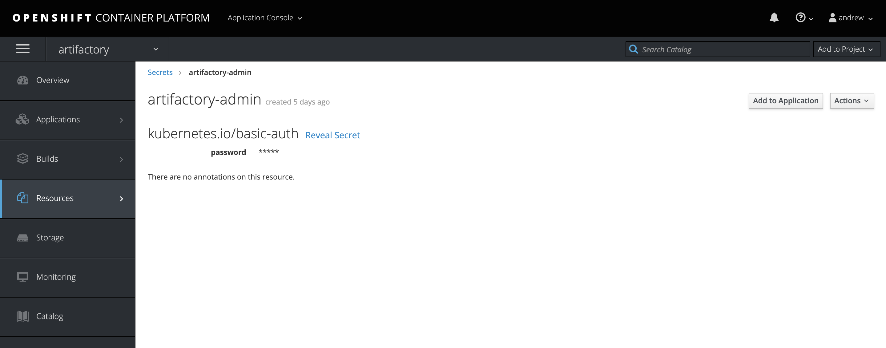

## Overview

This Ansible Operator has been written for Artifactory to handle multi-tenancy, repo creation and user permissions.

## High-level architecture

 

## Repository tree

```
$ tree
.
├── README.md
├── build
│   ├── Dockerfile
│   └── test-framework
│       ├── ansible-test.sh
│       └── Dockerfile
├── cleanup.md
├── deploy
│   ├── crds
│   │   ├── artifactory-cr-template.yaml
│   │   ├── artifactoryrepo_v1alpha1_artifactoryrepo_crd.yaml
│   │   ├── lab-ops-rolebinding.yaml
│   │   └── team-type-locator.env
│   ├── operator.yaml
│   ├── role_binding.yaml
│   ├── role.yaml
│   └── service_account.yaml
├── images
│   ├── admin-secret.png
│   └── Artifactory-operator.png
├── roles
│   ├── artifactory
│   │   ├── defaults
│   │   │   └── main.yml
│   │   ├── files
│   │   │   └── repo.json
│   │   ├── handlers
│   │   │   └── main.yml
│   │   ├── meta
│   │   │   └── main.yml
│   │   ├── README.md
│   │   ├── tasks
│   │   │   └── main.yml
│   │   └── vars
│   │       └── main.yml
│   └── main.yml
└── watches.yaml

18 directories, 32 files
```

#### Create Custom Resource Definition for Artifactory

Cluster admin will be required to create the cluster wide CRD and associated role (for managing the CR objects).

``` bash
$pwd
/artifactory/artifactory-operator
```
##### Give the service account for the Artifactory Operator deployment required permissions


Adding a cluster-rolebinding for the artifactory-admin role is not covered by this installation, but will be required for any accounts that will be managing the lifecycle of the CRs.
A separate PR to add a cluster CR role to the bcdevex-admin team has been created in the devops-platform-operations-docs repo (PR-13)

Admins must run the following:
```
crds/crd-artifactoryrepo.yaml
rbac/clusterrole-artifactory-operator.yaml
rbac/clusterrole-artifactory-admin.yaml
rbac/clusterrolebinding-artifactory-operator.yaml
rbac/clusterrolebinding-artifactory-admins.yaml
```

example command to add this cluster-role to an account:

``` bash
oc adm policy add-cluster-role-to-user artifactory-admin <username>
```

#### Build Operator Image:

``` bash    
$pwd
/artifactory/artifactory-operator
```

``` bash
$ operator-sdk build <image-name>
$ docker push <image-name>
# alt push method:
# ../oc-push-image.sh -i <image-name> -n <namespace> -r docker-registry.pathfinder.gov.bc.ca

$ oc -n <namespace> tag <image-name>:latest <image-name>:v1-stable
```

Replace the image name in the Operator deployment:

``` bash
$ cat deploy/operator.yaml
```

``` yaml
apiVersion: apps/v1
kind: Deployment
metadata:
  name: artifactory-operator
spec:
  replicas: 1
  selector:
    matchLabels:
      name: artifactory-operator
  template:
    metadata:
      labels:
        name: artifactory-operator
    spec:
      serviceAccountName: artifactory-operator
      containers:
        - name: ansible
          command:
          - /usr/local/bin/ao-logs
          - /tmp/ansible-operator/runner
          - stdout
          # Replace this with the built image name
          image: "<REPLACE-ME>" <<<REPLACE IMAGE>>>
          imagePullPolicy: "Always"
          volumeMounts:
          - mountPath: /tmp/ansible-operator/runner
            name: runner
            readOnly: true
        - name: operator
          # Replace this with the built image name
          image: "<REPLACE-ME>" <<<REPLACE IMAGE>>>
          imagePullPolicy: "Always"
          volumeMounts:
          - mountPath: /tmp/ansible-operator/runner
            name: runner
          - mountPath: /tmp/ansible-operator/
            name: artifactory-secret
            readOnly: true
          env:
            - name: WATCH_NAMESPACE
              valueFrom:
                fieldRef:
                  fieldPath: metadata.namespace
            - name: POD_NAME
              valueFrom:
                fieldRef:
                  fieldPath: metadata.name
            - name: OPERATOR_NAME
              value: "artifactory-operator"
      volumes:
        - name: runner
          emptyDir: {}
        - name: artifactory-secret
          secret:
            secretName: artifactory-admin
```

## How to run

#### Change project context

``` bash
oc project <artifactory-project>
```

#### Confirm Administrative Secret

In the project, confirm that the secret `artifactory-admin` exists with a password for Artifactory. Leave Username blank.



#### Deploy Artifactory Operator

``` bash
oc apply -f deploy/operator.yaml
```

## Creating Artifactory Custom Resources and Objects

> Must have cluster-role artifactory-admin

An example Artifactory CR (Custom Resource) exists under `deploy/crds/artifactory-cr-template.yaml`

An example env file also exists under `deploy/crds/team-type-locator.env`

| Parameter                 | Comments                                                 | 
|---------------------------|----------------------------------------------------------|
| CONSOLE_NAME              | Name of the environment (prod or lab)                    |
| TEAM_NAME                 | Name of the repository                                   |
| REPO_TYPE                 | Type: docker, maven etc                                  |
| REPO_LOCATOR              | local or virtual                                         |
| REPO_DESCRIPTION          | Description of the repo                                  |
| LIST_REPOS_VIRTUAL        | If type virtual, list local repos to add to virtual repo |

Create the Custom Resource:

``` bash
 oc --as=system:serviceaccount:openshift:bcdevops-admin process -f artifactory-cr-template.yaml --param-file=team-type-locator.env --ignore-unknown-parameters=true | oc --as=system:serviceaccount:openshift:bcdevops-admin create -f -
```
