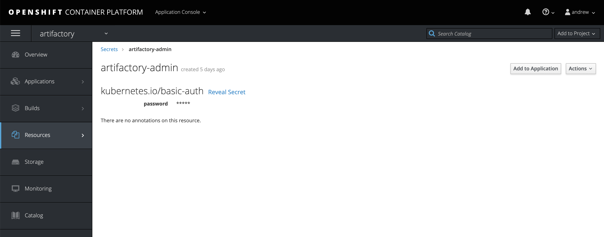

## Overview

This Ansible Operator has been written for Artifactory to handle service account creation.

## High-level architecture

 

## Repository tree

```
$ tree
.
├── README.md
├── build
│   ├── Dockerfile
│   └── test-framework
│       ├── ansible-test.sh
│       └── Dockerfile
├── cleanup.md
├── deploy
│   ├── crds
│   │   ├── artifactory-cr-template.yaml
│   │   ├── artifactoryrepo_v1alpha1_artifactoryrepo_crd.yaml
│   │   ├── lab-ops-rolebinding.yaml
│   │   └── team-type-locator.env
│   ├── operator.yaml
│   ├── role_binding.yaml
│   ├── role.yaml
│   └── service_account.yaml
├── images
│   ├── admin-secret.png
│   └── Artifactory-operator.png
├── roles
│   ├── artifactory
│   │   ├── defaults
│   │   │   └── main.yml
│   │   ├── files
│   │   │   └── repo.json
│   │   ├── handlers
│   │   │   └── main.yml
│   │   ├── meta
│   │   │   └── main.yml
│   │   ├── README.md
│   │   ├── tasks
│   │   │   └── main.yml
│   │   └── vars
│   │       └── main.yml
│   └── main.yml
└── watches.yaml

18 directories, 32 files
```

#### Create Custom Resource Definition for Artifactory

Cluster admin will be required to create the cluster wide CRD and associated role (for managing the CR objects).

``` bash
$pwd
/artifactory/artifactory-sa-operator
```
##### Give the service account for the Artifactory Operator deployment required permissions


Adding a cluster-rolebinding for the artifactory-admin role is not covered by this installation, but will be required for any accounts that will be managing the lifecycle of the CRs.
A separate PR to add a cluster CR role to the bcdevex-admin team has been created in the devops-platform-operations-docs repo (PR-13)

Admins must run the following:
```
crds/crd-artifactorysa.yaml
rbac/clusterrole-artifactory-sa-operator.yaml
rbac/clusterrole-artifactory-sa-aggregate.yaml
rbac/clusterole-artifactory-sa-admin.yaml
rbac/clusterrolebinding-artifactory-sa-operator.yaml
rbac/clusterrolebinding-artifactory-sa-admins.yaml
```

example command to add this cluster-role to an account:

``` bash
oc adm policy add-cluster-role-to-user artifactory-sa-admin <username>
```

#### Build Operator Image:

``` bash    
$pwd
/artifactory/artifactory-sa-operator
```

``` bash
$ operator-sdk build <image-name>
$ docker push <image-name>
# alt push method:
# oc-push-image.sh -i <image-name> -n <namespace> -r docker-registry.pathfinder.gov.bc.ca

$ oc -n <namespace> tag <image-name>:latest <image-name>:v1-stable
```

Replace the image name in the Operator deployment:

``` bash
$ deploy/operator.yaml
```

## How to run

#### Change project context

``` bash
oc project <artifactory-project>
```

#### Confirm Administrative Secret

In the project, confirm that the secret `artifactory-admin` exists with a password for Artifactory. Leave Username blank.



#### Deploy Artifactory Operator

``` bash
oc apply -f deploy/operator.yaml
```

## Creating Artifactory Custom Resources and Objects

> Must have cluster-role artifactory-admin

An example Artifactory CR (Custom Resource) exists under `deploy/crds/artifactory-sa-cr-template.yaml`

An example env file also exists under `deploy/crds/serviceaccount.env`

Create the Custom Resource:

``` bash
 oc process -f artifactory-sa-cr-template.yaml --param-file=serviceaccount.env --ignore-unknown-parameters=true | oc create -f -
```
