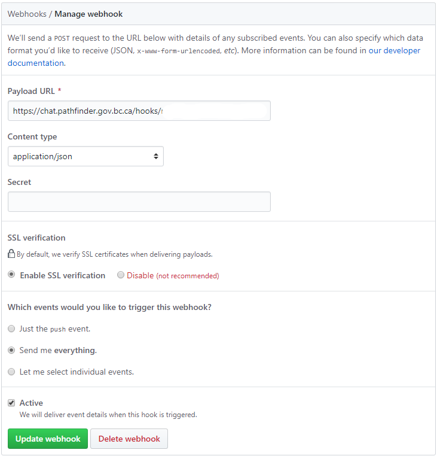

# Incoming WebHook Scripting:

Refer to the official [Incoming WebHook Scripting](https://rocket.chat/docs/administrator-guides/integrations/) documentation for information on how to setup an incoming WebHook in Rocket.Chat.  Use one of the following scripts (or create your own) and paste it into the **Script** field associated with the WebHook integration.

## GitHub

The [GitHub WebHook Integration Script](./scripts/github/rocket.chat.integration.js) is an enhanced version of the [GitHub - Example script 1](https://rocket.chat/docs/administrator-guides/integrations/github/#example-script-1) script in the official Rocket.Chat documentation, and can be used to provide a GitHub feed for your team.

To create a WebHook in GitHub:
1. Browse to the repository.
1. On the `Settings` tab, select Webhooks.
1. Click add WebHook.
1. Paste the **WebHook URL** generated by the Rocket.Chat integration into the **Payload URL** field.
1. Settings should look like this;

## Docker Hub

The [Docker Hub WebHook Integration Script](./scripts/dockerhub/rocket.chat.integration.js) can be used to post notifications to a channel when new images are pushed to your Docker Hub repository.

The payload of the Docker WebHook is not well documented, a recent (2019.04.08) sample can be found here; [Docker Hub WebHook Payload Example](./scripts/dockerhub/DockerHubWebhookPayloadExample.json).

On the WebHook tab of your Docker Hub repository, add a new WebHook and use the generated **WebHook URL** from the Rocket.Chat integration.

## Debugging 

The [Debug WebHook Integration Script](./scripts/debug/rocket.chat.capturepayload.js) can be used to capture sample payloads from a WebHook.  This integration script will simple print out the WebHook payload into a Rocket.Chat message.