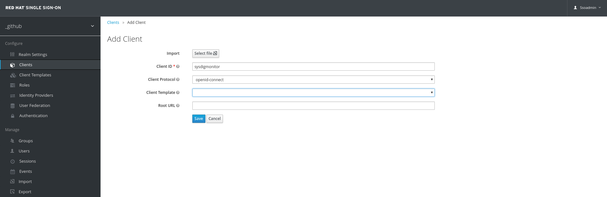
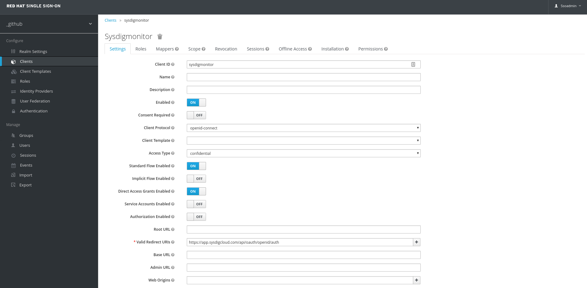
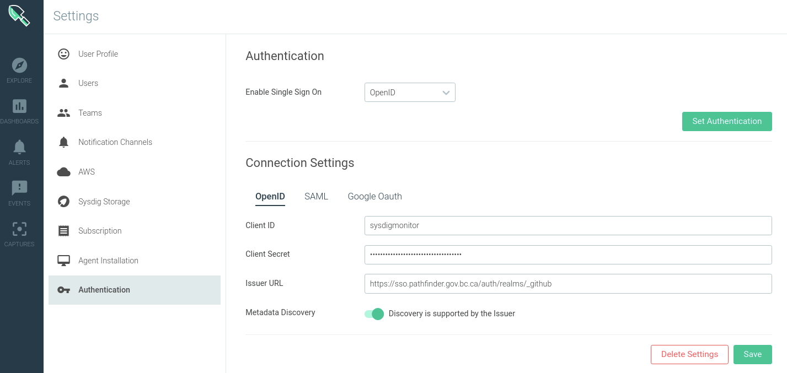

# Authentication
Sysdig is configured with OpenID Connect to leverage the BCGov Keycloak SSO instance for authentication. 

## OpenID Connect Configuration
Keycloak and Sysdig were configured manually for the OIDC integration (sad face :( )). The following screenshots were used to configure each component. The secrets tab in the Keycloak SSO instance was used to gather secret for the Sysdig configuration. 

## Auth Realm
The Next Gen Security realm is used for auth to Sysdig. 

## The Client Org
The Client Org for Sysdig is called `BCDevOps`. Users can login here: [https://app.sysdigcloud.com/api/oauth/openid/bcdevops](https://app.sysdigcloud.com/api/oauth/openid/bcdevops)
