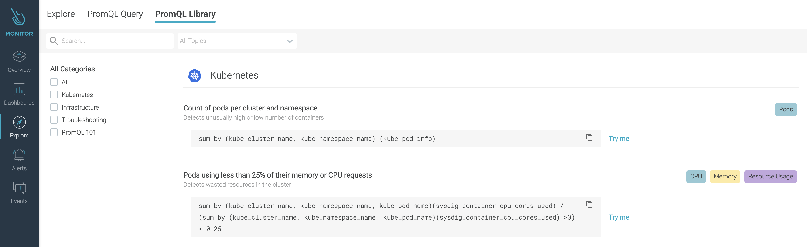

# Get Started with Sysdig Monitoring

Sysdig Monitor is a SaaS service that provides system level monitoring of Kubernetes hosts. This solution provides the ability to create custom dashboards, alerts, and operational level captures to help diagnose application or platform level issues. 

The Sysdig Teams Operator that is running in the cluster enables a team to create and manage access control to a **dedicated Sysdig Team account** for BC Government OpenShift platform users. The team is scoped specifically to the OpenShift namespaces that belong to a specific team, and also provides a high-level default dashboard to identify system resources, limits, and actual usage.

You can find the overall Sysdig monitoring service described [here](https://developer.gov.bc.ca/BC-Government-Sysdig-Monitoring-Service-Definition).

> Please note that this does not provide a comprehensive overview of the Sysdig Monitor UI or service, however, the **Resources** section below contains links to the Sysdig Monitor User Documentation for more detail.  

## Step 1 - Login to Sysdig
First thing first, please have you and your team login to Sysdig to create the user account. Our Sysdig uses OpenID Connect, and requires a Github account.

- Navigate to the BCDevOps Sysdig Monitor URL [https://app.sysdigcloud.com/api/oauth/openid/bcdevops](https://app.sysdigcloud.com/api/oauth/openid/bcdevops)
  - Alternatively, navigate to [https://app.sysdigcloud.com](https://app.sysdigcloud.com), select OpenID, and type in `BCDevOps` as the company
- Upon login, you will be presented with a default page. You may be directed to the **Catchall Team** which has access to no resources at the moment (you'll see them after the team access is created in later steps!)
- Find your name initial icon at the bottom left corner. There you can see the email address that represents your account.
  - **Note** that Sysdig identifies users by the email, so it's important to use the correct email addr for yourself as well as your team members

## Step 2 - Create Sysdig Team Access
We are running an OpenShift Operator in the background that creates Sysdig RBAC and dashboard for you. The operator is looking for a `sysdig-team` custom resource from your `*-tools` namespace. The `sysdig-team` resource will:

- Create a Custom Resource in your project *Tools* namespace 
- Create an access control list within the Custom Resource that *identifies users by the ***email address***
  - *Note* all team members will need to login to Sysdig first, the email address can be found by each user from [Sydig User Profile](https://app.sysdigcloud.com/#/settings/user)
  - Only GitHub ID's are currently configured from SSO
- Upon creating the CR, **TWO** teams will be created; 
  - **[license-plate]-team** - All Kubernetes related objects can be monitored here, with the exception of persistent volume claim metrics. 
  - **[license-plate]-team-persistent-storage** - Persistent Volume Claim utilization can be monitored here. 
  - *Note* PVC metrics are now scraped from kubelet services which is not longer available from `kubernetes.*` scope

### Sample sysdig-team object
```yaml
apiVersion: ops.gov.bc.ca/v1alpha1
kind: SysdigTeam
metadata:
  name: 101ed4-sysdigteam
spec:
  team:
    description: The Sysdig Team for the Platform Services Documize
    users:
    - name: shelly.han@gov.bc.ca
      role: ROLE_TEAM_MANAGER
    - name: patrick.simonian@gov.bc.ca
      role: ROLE_TEAM_EDIT
    - name: billy.li@gov.bc.ca
      role: ROLE_TEAM_STANDARD
    - name: olena.mitovska@gov.bc.ca
      role: ROLE_TEAM_READ
```

### Available Roles
The following roles are available for use: 
- `ROLE_TEAM_MANAGER (Team Manager, mandatory)` - Can create/edit/delete dashboards, alerts, or other content + ability to add/delete team members or change team member permissions. ***Please note it's mandatory to have at least one team manager, otherwise the operator can't create default templates for you!***
- `ROLE_TEAM_EDIT (Advanced User)` - Can create/edit/delete dashboards, alerts, or other content.
- `ROLE_TEAM_STANDARD (Standard User)` - An Advanced User with no access to the Explore page (e.g. for developers who are not interested in Monitoring information).
- `ROLE_TEAM_READ (View-only User)` - Read access to the environment within team scope, but cannot create, edit, or delete dashboards, alerts, or other content.

**Note** Role Updates should be applied to the CR, and **NOT** in the Sysdig Monitor UI. Reconciliation of the SysdigTeams Operator will overwrite any UI changes to the team roles. 

### Creating the Sysdig Team
- Using `oc apply` with the above example custom resource yaml in your `-tools` namespace, the Sysdig Team will be created by the operator as outlined in the below example; 
  ```shell
  oc project 101ed4-tools
  oc apply -f sysdigteam-sample.yml
  ```
- Validate the creation of the Sysdig Team using `oc describe sysdig-team`
  ```shell
  apiVersion: ops.gov.bc.ca/v1alpha1
  kind: SysdigTeam
  metadata:
    creationTimestamp: "2021-04-15T22:42:20Z"
    finalizers:
    - finalizer.ops.gov.bc.ca
    generation: 1
    name: 101ed4-sysdigteam
    namespace: 101ed4-tools
  spec:
    team:
      description: The Sysdig Team for the Platform Services Documize
      users:
      - name: shelly.han@gov.bc.ca
        role: ROLE_TEAM_MANAGER
      - name: patrick.simonian@gov.bc.ca
        role: ROLE_TEAM_EDIT
      - name: billy.li@gov.bc.ca
        role: ROLE_TEAM_STANDARD
      - name: olena.mitovska@gov.bc.ca
        role: ROLE_TEAM_READ
  status:
    conditions:
    - ansibleResult:
        changed: 0
        completion: 2021-08-08T20:08:03.685003
        failures: 0
        ok: 30
        skipped: 13
      lastTransitionTime: "2021-08-05T18:54:24Z"
      message: Awaiting next reconciliation
      reason: Successful
      status: "True"
      type: Running

  ```

***NOTE*** if your project set is on Gold and GoldDR clusters, please only create the sysdig-team Custom Resource in Gold cluster. Our sysdig operator will be able to pick it up and create the dashboards for you apps across the two clusters.

## Step 3 - Logging Into Your Sysdig Team
Now that you've created the custom resource, you can go back to Sysdig again to see the new team scope and default dashboards.
- login to Sysdig like how you did just now
- Navigate to the bottom left hand of the page to switch your team

- **You may need to wait some time between the creation of the team and resources to display** 


## Step 4 - Monitoring Dashboards
As promised, there are two sysdig teams created
- A simple resource dashboard has been created to provide and overview of limits and requests across all team namespaces


- A simple persistent storage dashboard has been created to provide an overview of all Persistent Volume Claim utilization. 
**Note: PVC's must be attached to a running pod for their metrics to be displayed on this dashboard.**


- A series of pre-defined dashboards exist for general usage or to assist in creating custom dashboards; with a user that has an appropriate permissions
- Navigate to the `Dashboards` Icon, select `Add Dashboard` and select `Create from Template`


## Step 5 - Alert Channels
Currently Alert Channels can be created manually through the Sysdig Monitor UI. 

### Creating a Rocket.Chat Alert Channel
The following walk through provides a sample for integrating Sysdig Alerts with Rocket.Chat. Both Sysdig Monitor and Rocket.Chat require configurations. 
- Sysdig Monitor will create a **Webhook** notification channel
- Rocket.Chat will create an **incoming webhook** with a custom script


#### Configuring Rocket.Chat
Rocket.Chat requires an Incoming Webhook and a script to parse the data from Sysdig. 
- Create the Incoming Webhook


- Use the following sample script for basic alert message creation
```js
class Script {
  process_incoming_request({ request }) {
    console.log(request.content);

    var date = new Date(request.content.timestamp);
    
    var alertColor = "warning";

    if(request.content.resolved === "true"){ alertColor = "good"; }
    else if (request.content.status === "ACTIVE") { alertColor = "danger"; }
    return {
      content: {
        icon_url: "https://pbs.twimg.com/profile_images/1033062307352338432/AAPSOLRs_400x400.jpg",
        text: "Sysdig Notification",
        attachments: [{
          title: request.content.alert.name,
          pretext: request.content.alert.description,
          title_link: request.content.event.url,
          color: alertColor,
          fields: [
            {
              title: "State",
              value: request.content.state
            },
            {
              title: "Condition",
              value: request.content.condition
            }
          ]
      }]
      }
    };
  }
}
```

#### Creating the Sysdig Team Notification Channel
- When logged into the Sysdig Monitor UI, navigate to your user account and select `Settings`
- Select `Notification Channels` and `Add Notification Channel`, selecting `Webhook` as the type


- Input the webhook URL generated from RocketChat and configure the notification channel


- Select Save and either navigate to the `Alerts` section on the left hand navigation bar, or start adding custom alerts to any of your configured dashboards. 


## Step 6 - Advanced Usage
### Creating custom monitoring panels
Sysdig scrapes Prometheus metrics, you can create custom queries using PromQL. Here is a great way to start exploring:


### Creating a PromQL Based Alert
Some of the dashboard panels may be leveraging PromQL to display the metrics. PromQL can be used in Alerts as well. The following example shows an alert for the **Persistent Volume Utilization** when hitting 80% full. 

- Sample PromQL Query: `((avg(kubelet_volume_stats_used_bytes/kubelet_volume_stats_capacity_bytes) by (persistentvolumeclaim)) * 100) >= 80`  


# Additional Resources
- [Sysdig Monitor](https://docs.sysdig.com/en/sysdig-monitor.html)
- [Sysdig Monitor Dashboards](https://docs.sysdig.com/en/dashboards.html)
- [Sysdig Alerts](https://docs.sysdig.com/en/alerts.html)
- [Sysdig Alerts with Kubernetes and PromQL](https://sysdig.com/blog/alerting-kubernetes/)
- [Sysdig Teams Blog](https://sysdig.com/blog/introducing-sysdig-teams/)
- [Sysdig Teams Docs ](https://docs.sysdig.com/en/grouping,-scoping,-and-segmenting-metrics.html#al_UUID-c54169b7-c8f5-4990-6b63-dd2e25b96cce_UUID-3dc7a7aa-2549-23a2-94e2-cee57bdd538f)
- [Sysdig User Management Docs](https://docs.sysdig.com/en/manage-teams-and-roles.html)
- [Sysdig User Roles](https://docs.sysdig.com/en/user-and-team-administration.html)
