# SYSDIG IN OCP4 SILVER CLUSTER
The Sysdig service is currenly available to product teams developing in SILVER production cluster of the OCP 4 Platform. The teams using Sysdig are encouraged to connect with each other and with the Platform Services Team in `#devops-sysdig` channel in RocketChat.
This documentation does not provide a comprehensive overview of the Sysdig Monitor UI or service, however, the **Resources** section below contains links to the Sysdig Monitor User Documentation for more detail.  

# Sysdig Teams Feature Description
Sysdig Monitor is a SaaS service that provides system level monitoring of Kubernetes hosts. This solution provides the ability to create custom dashboards, alerts, and operational level captures to help diagnose application or platform level issues. 

The Sysdig Teams Operator that is running in the cluster enables a team to create and manage access control to a **dedicated Sysdig Team account** for BC Government OpenShift platform users. The team is scoped specifically to the OpenShift namespaces that belong to a specific team, and also provides a high-level default dashboard to identify system resources, limits, and actual usage. 


## The Sysdig Team Custom Resource
In order to create a Sysdig Team; 
- Create a Custom Resource in your project *Tools* namespace 
- Create a an access control list within the Custom Resource that identifies users by the email address that is registered in KeyCloak
  - *Note* Only GitHub ID's are currently configured in this realm
- Upon creating the CR, **TWO** teams will be created; 
  - **[license-plate]-team** - All Kubernetes realted objects can be monitored here, with the exception of persistent volume claim utilization. 
  - **[license-plate]-team-persistent storage** - Persistent Volume Claim utilization can be monitored here. 

The following sample custom resource can be used for reference; 

```yaml
apiVersion: ops.gov.bc.ca/v1alpha1
kind: SysdigTeam
metadata:
  name: c81e6h-sysdigteam
spec:
  team: 
    description: The Sysdig Team for the PMS Namespaces
    users:
    - name: husker@arctiq.ca
      role: ROLE_TEAM_READ 
    - name: shea.stewart+bcgov@arctiq.ca
      role: ROLE_TEAM_MANAGER
    - name: shea.stewart+tester@arctiq.ca
      role: ROLE_TEAM_EDIT
    - name: boomer@arctiq.ca
      role: ROLE_TEAM_READ 
```

### Available Roles
The following roles are available for use: 
- **ROLE_TEAM_EDIT (Advanced User)** - Can create/edit/delete dashboards, alerts, or other content.
- **ROLE_TEAM_STANDARD (Standard User)** - An Advanced User with no access to the Explore page (e.g. for developers who are not interested in Monitoring information).
- **ROLE_TEAM_READ (View-only User)** - Read access to the environment within team scope, but cannot create, edit, or delete dashboards, alerts, or other content.
- **ROLE_TEAM_MANAGER (Team Manager)** - Can create/edit/delete dashboards, alerts, or other content + ability to add/delete team members or change team member permissions.

**Note** Role Updates should be applied to the CR, and **NOT** in the Sysdig Monitor UI. Reconcilliation of the SysdigTeams Operator will overwrite any UI changes to the team roles. 

### Creating the Sysdig Team
- Using `oc apply` with the above example custom resource yaml in your `-tools` namespace, the Sysdig Team will be created by the operator as outlined in the below example; 
  ```shell
  oc project c81e6h-tools
  oc apply -f sysdigteam-sample.yml
  ```
- Validate the creation of the Sysdig Team using `oc describe sysdig-team`
  ```shell
  Name:         c81e6h-sysdigteam
  Namespace:    c81e6h-tools
  Labels:       <none>
  Annotations:  kubectl.kubernetes.io/last-applied-configuration={"apiVersion":"ops.gov.bc.ca/v1alpha1","kind":"SysdigTeam","metadata":{"annotations":{},"name":"c81e6h-sysdigteam","namespace":"c81e6h-tools"},"spec":{
  ...
  API Version:  ops.gov.bc.ca/v1alpha1
  Kind:         SysdigTeam
  Metadata:
    Creation Timestamp:  2020-01-27T05:25:55Z
    Finalizers:
      finalizer.ops.gov.bc.ca
    Generation:        1
    Resource Version:  1436022248
    Self Link:         /apis/ops.gov.bc.ca/v1alpha1/namespaces/c81e6h-tools/sysdig-teams/c81e6h-sysdigteam
    UID:               7e02ff08-40c5-11ea-8a92-0050568379a2
  Spec:
    Team:
      Description:  The Sysdig Team for the PMS Namespaces
      Users:
        Name:  husker@arctiq.ca
        Role:  ROLE_TEAM_READ
        Name:  shea.stewart+bcgov@arctiq.ca
        Role:  ROLE_TEAM_MANAGER
        Name:  shea.stewart+tester@arctiq.ca
        Role:  ROLE_TEAM_EDIT
        Name:  boomer@arctiq.ca
        Role:  ROLE_TEAM_READ
  Status:
    Conditions:
      Ansible Result:
        Changed:             0
        Completion:          2020-01-27T05:30:39.422111
        Failures:            0
        Ok:                  33
        Skipped:             11
      Last Transition Time:  2020-01-27T05:29:50Z
      Message:               Awaiting next reconciliation
      Reason:                Successful
      Status:                True
      Type:                  Running
  Events:                    <none>

  ```
  

## Logging Into A Sysdig Team
In order to access the Sysdig Monitor application and your team resources: 
- Navigate to the BCDevOps Sysdig Monitor URL [https://app.sysdigcloud.com/api/oauth/openid/bcdevops](https://app.sysdigcloud.com/api/oauth/openid/bcdevops)
  - Alternatively, navitage to [https://app.sysdigcloud.com](https://app.sysdigcloud.com), select OpenID, and type in `BCDevOps` as the company
- Upon login, you will be presented with a default page. You may be directed to the **Catchall Team** which has access to no resources
- Navigate to the bottom left hand of the page to switch your team
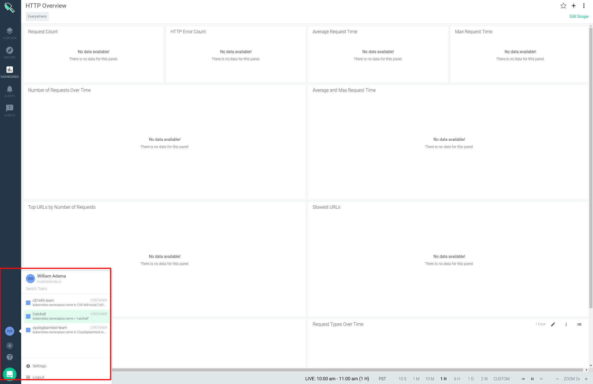
- **You may need to wait some time between the creation of the team and resources to display** 

### Dashboards
- A simple resource dashboard has been created to provide and overview of limits and requests across all team namespaces
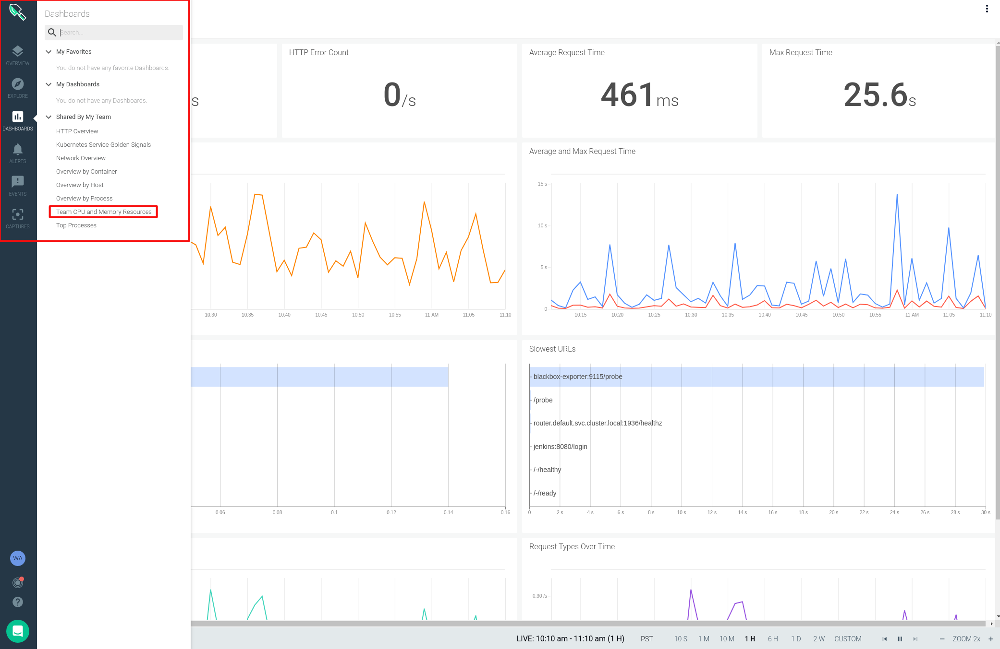
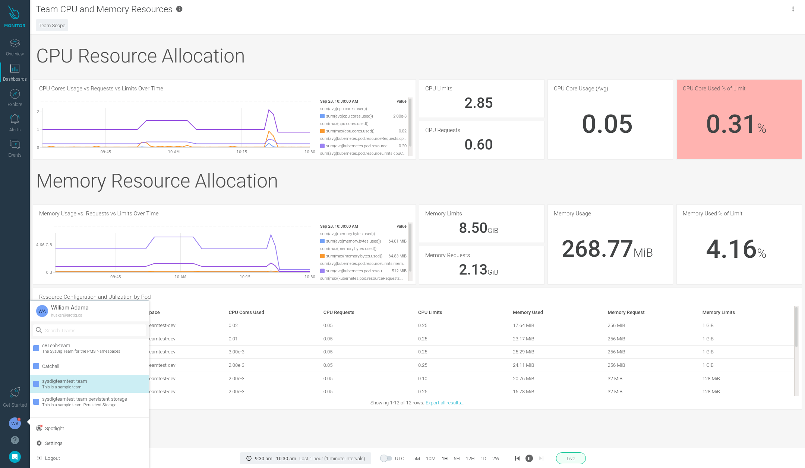

- A simple persistent storage dashbaord has been created to provide an overview of all Persistent Volume Claim utilization. 
**Note: PVC's must be attached to a running pod for their metrics to be displayed on this dashboard.**
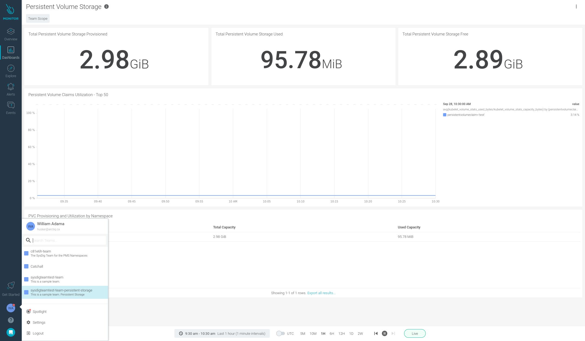


- A series of pre-defined dashboards exist for general usage or to assist in creating custom dashboards; with a user that has an appropriate permissions
- Navigate to the `Dashboards` Icon, select `Add Dashboard` and select `Create from Template`
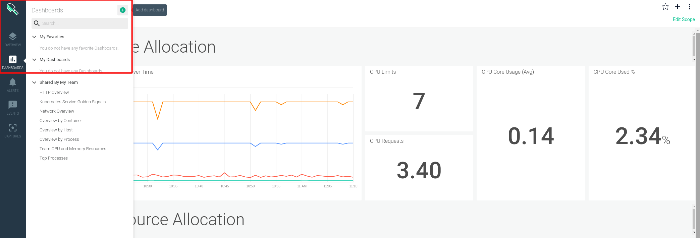
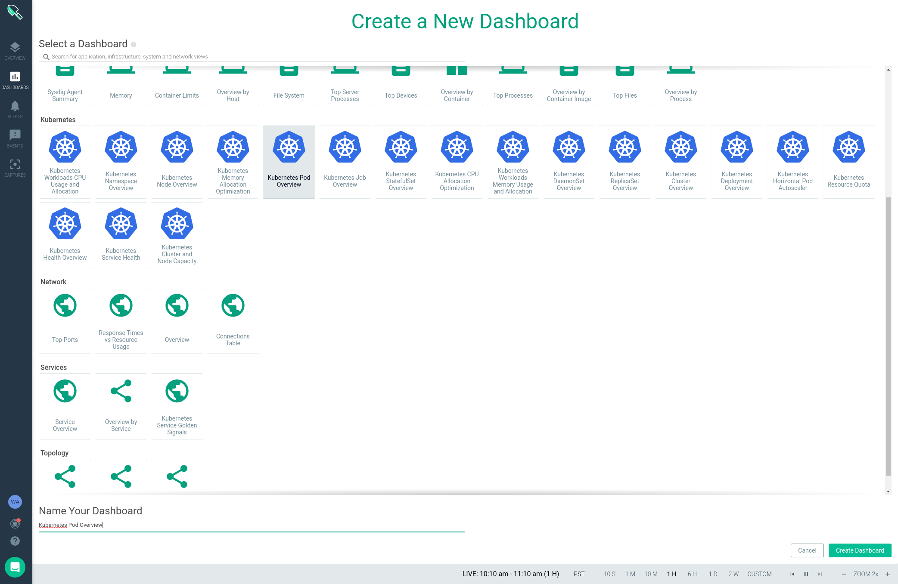


## Alert Channels
Currently Alert Channels can be created manually through the Sysdig Monitor UI. 

### Creating a Rocket.Chat Alert Channel
The following walkthrough provides a sample for integrating Sysdig Alerts with Rocket.Chat. Both Sysdig Monitor and Rocket.Chat require configurations. 
- Sysdig Monitor will create a **Webhook** notification channel
- Rocket.Chat will create an **incoming webhook** with a custom script


#### Configuring Rocket.Chat
Rocket.Chat requires an Incoming Webhook and a script to parse the data from Sysdig. 
- Create the Incoming Webhook

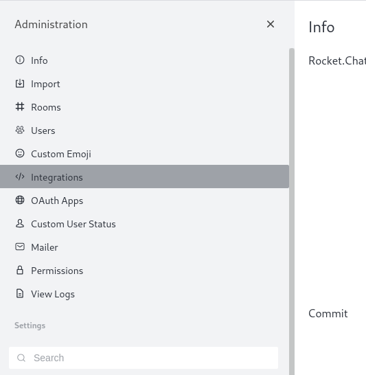
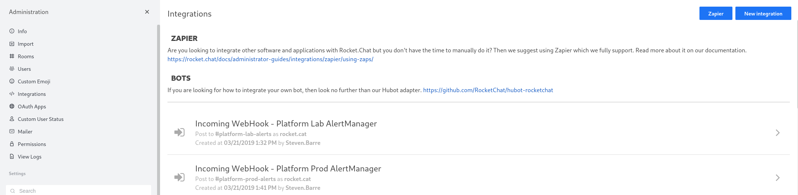
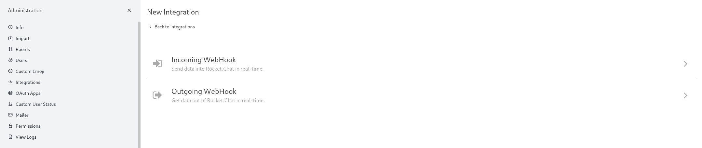
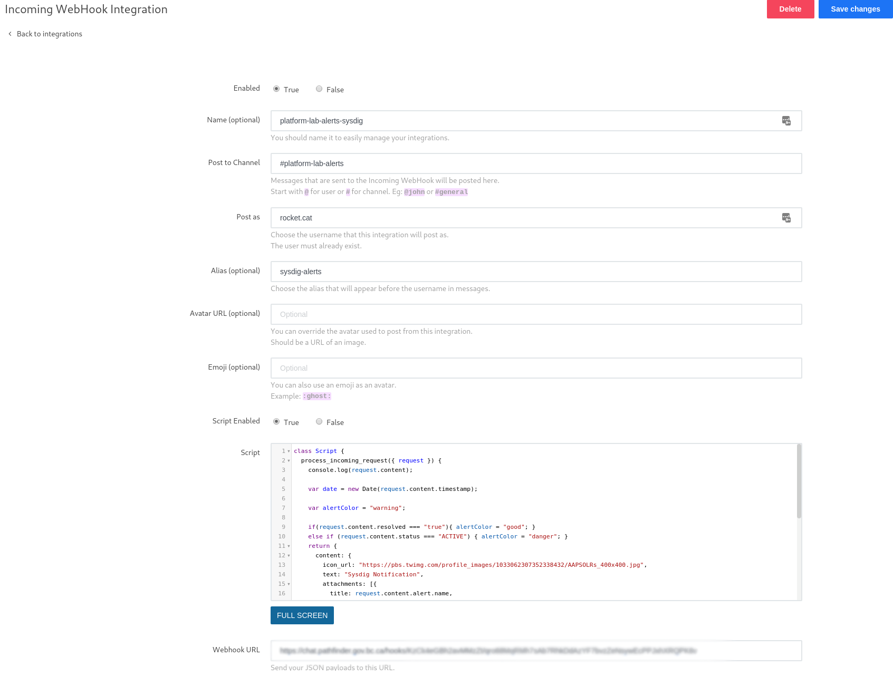


- Use the following sample script for basic alert message creation
```js
class Script {
  process_incoming_request({ request }) {
    console.log(request.content);

    var date = new Date(request.content.timestamp);
    
    var alertColor = "warning";

    if(request.content.resolved === "true"){ alertColor = "good"; }
    else if (request.content.status === "ACTIVE") { alertColor = "danger"; }
    return {
      content: {
        icon_url: "https://pbs.twimg.com/profile_images/1033062307352338432/AAPSOLRs_400x400.jpg",
        text: "Sysdig Notification",
        attachments: [{
          title: request.content.alert.name,
          pretext: request.content.alert.description,
          title_link: request.content.event.url,
          color: alertColor,
          fields: [
            {
              title: "State",
              value: request.content.state
            },
            {
              title: "Condition",
              value: request.content.condition
            }
          ]
      }]
      }
    };
  }
}
```

#### Creating the Sysdig Team Notification Channel
- When logged into the Sysdig Monitor UI, navigate to your user account and select `Settings`
- Select `Notification Channels` and `Add Notification Channel`, selecting `Webhook` as the type
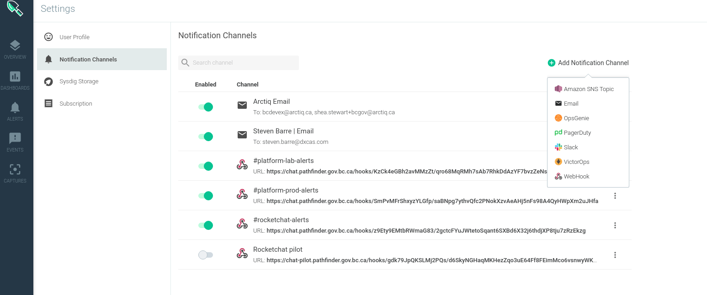

- Input the webhook URL generated from RocketChat and configure the notification channel
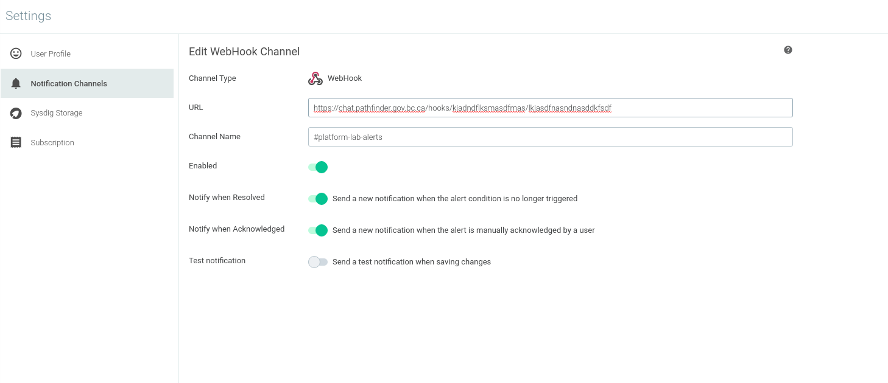

- Select Save and either navigate to the `Alerts` section on the left hand navigation bar, or start adding custom alerts to any of your configured dasboards. 
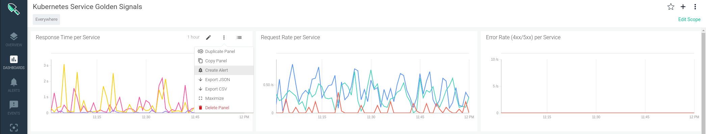
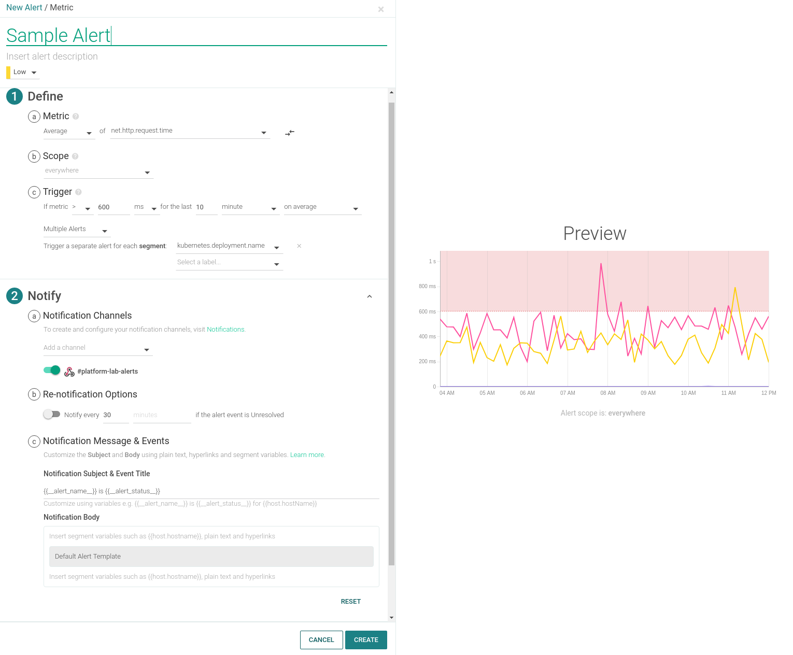

#### Creating a PromQL Based Alert
Some of the dashboard panels may be leveraging PromQL to display the metrics. PromQL can be used in Alerts as well. The following example shows an alert for the **Persistent Volume Utilization** when hitting 80% full. 

- Sample PromQL Query: `((avg(kubelet_volume_stats_used_bytes/kubelet_volume_stats_capacity_bytes) by (persistentvolumeclaim)) * 100) >= 80`  
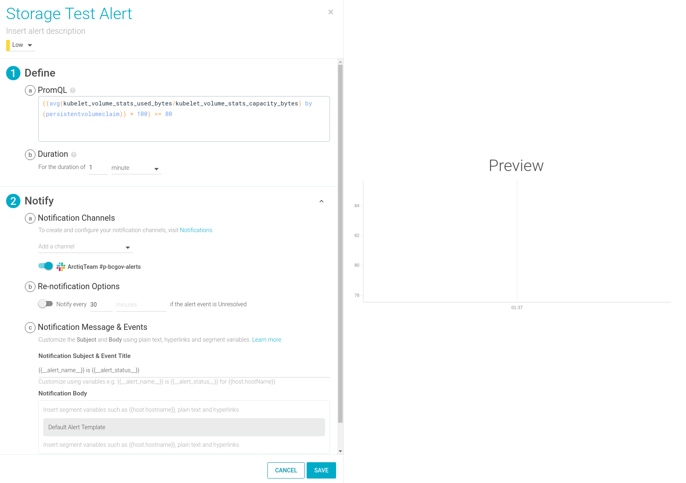


# Additional Resources
- [Sysdig Monitor](https://docs.sysdig.com/en/sysdig-monitor.html)
- [Sysdig Monitor Dashboards](https://docs.sysdig.com/en/dashboards.html)
- [Sysdig Alerts](https://docs.sysdig.com/en/alerts.html)
- [Sysdig Alerts with Kubernetes and PromQL](https://sysdig.com/blog/alerting-kubernetes/)
- [Sysdig Teams Blog](https://sysdig.com/blog/introducing-sysdig-teams/)
- [Sysdig Teams Docs ](https://docs.sysdig.com/en/grouping,-scoping,-and-segmenting-metrics.html#al_UUID-c54169b7-c8f5-4990-6b63-dd2e25b96cce_UUID-3dc7a7aa-2549-23a2-94e2-cee57bdd538f)
- [Sysdig User Management Docs](https://docs.sysdig.com/en/manage-teams-and-roles.html)
- [Sysdig User Roles](https://docs.sysdig.com/en/user-and-team-administration.html)
