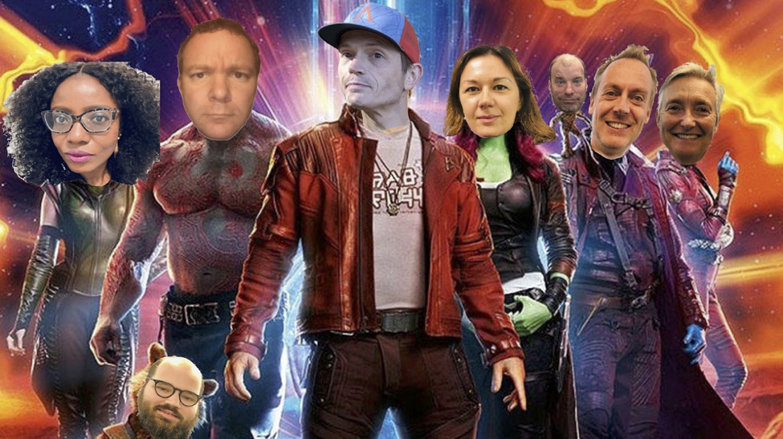

**Next Gen Application Security Project**

**The Next Gen Application Security Project has come to its end with the set of security tools that have been ideentified for the BC Gov's Openshift Platform, been implemented as part of the Openshift 4 Platform Build-Out. This page is now archived.**

**The B I G Idea**

What if we could develop the <b>most secure application deployment environment</b> in the BC Government?..

How would life change for **brilliant developers** across all ministries who struggle getting their genius products to prime time, in time?

How would nights change for **innovative technology leaders,** sleeping with one eye open—on constant vigil for invasive security threats and attacks?

How would services change for **engaged public citizens** who crave safe and timely access to the muscle and power of our government&#39;s growing business strength?

Bring on the change!

We're advancing forward with the emerging **Zero-Trust Model** to take our **DevOps Openshift Platform** to the next level. Working closely with the teams that use OpenShift every day, our new **Cloud Enabled** security model and **expanded toolkit** will include premium security capabilities, such as:

- real-time container scanning for vulnerabilities
- secrets management
- real-time threat response, and
- security posture dashboard and continuous STRA/PIA compliance check.

**Meet Our Team**

We&#39;re light, we&#39;re tight. We&#39;re agile optimists. And, we&#39;re your &quot; **Guardians Of The OpenShift&quot;** galaxy (GOTO Team). We get up every morning to protect the citizens we serve by:

- ( + ) increasing security
- ( - )  reducing the risk profile of Platform applications, and
- ( ! )  having fun!

_Left to Right: Tolu, Justin, Nick, Shea, Olena, Todd, Jason, Stephanie_

**Enter > The Heroes!**

An idea this **B I G** needs the force of the universe behind it. That&#39;s where the real heroes come in. These are the **innovators and early adopters** , who have raised their shields to **test and pilot** the new technology in real time. Give it up for our **partner Ministry production pilots**, who include:

- AG: Family Protection Order

- PSSG: Road Safety

- NRM: Mines Digital Services

**But Wait, There&#39;s More!**

Wondering **how the project&#39;s going**? Thanks for your concern. Click [here](https://drive.google.com/drive/folders/1oCb9LtAjSaElhECEn1xcByfzacjXxQKw);

Curious about what **problems we&#39;ve solved**? Got it. Click [here](https://drive.google.com/file/d/1kivnb0tZA7TE3hdzTNl2vKjwxgWR3zj-/view?usp=sharing);

Wanna see our **code**? We&#39;re open kimono . . .  Click [here](https://github.com/BCDevOps/platform-services/tree/master/security/aporeto);

Would you like to **get involved**? Knew it! Find us in Rocketchat **#devops-security**
