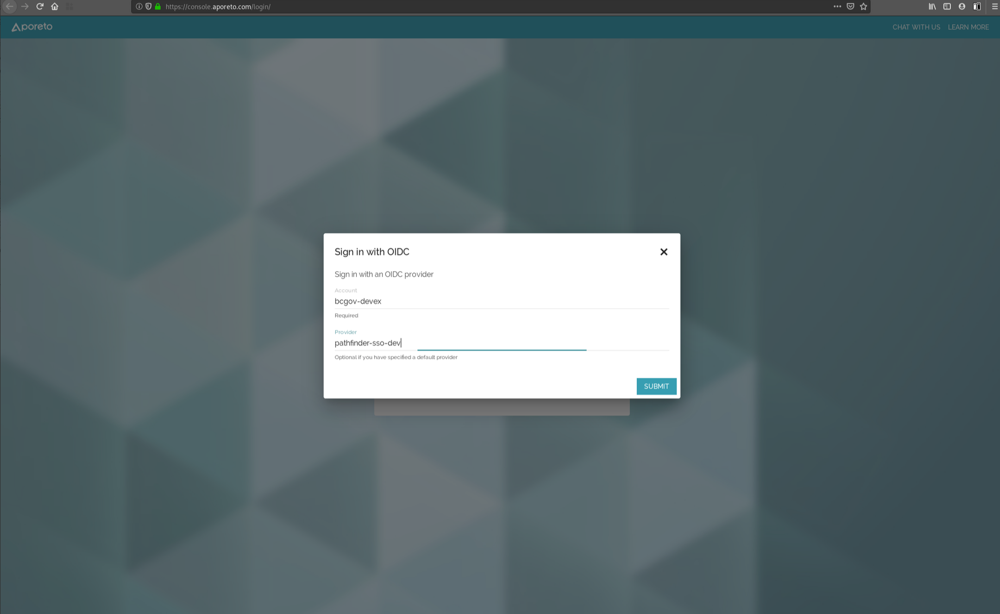
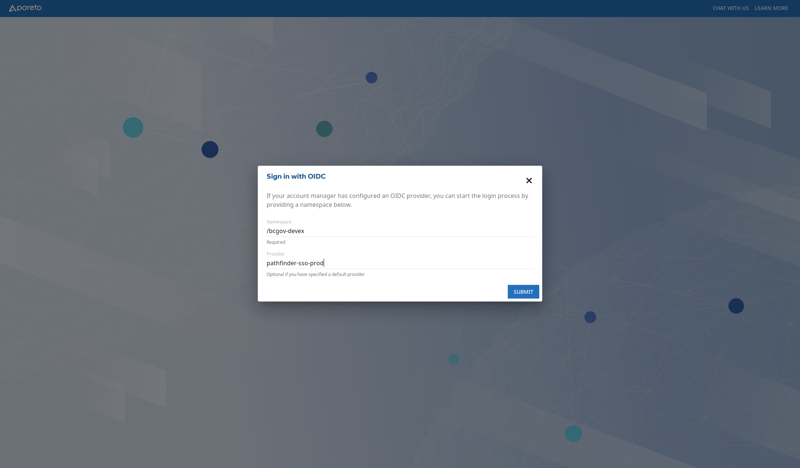
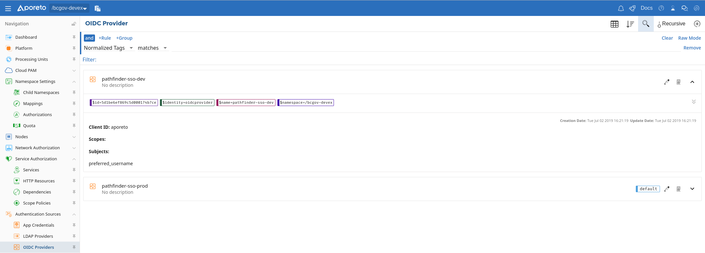
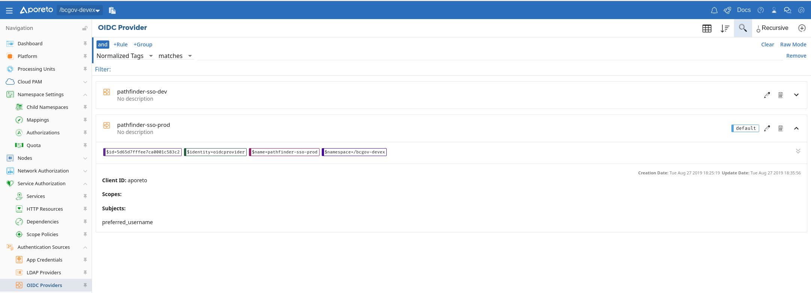
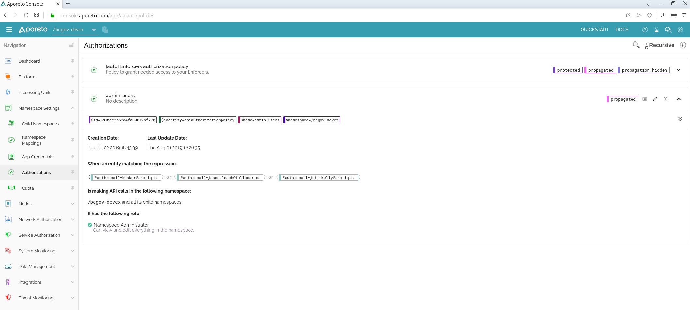

# Aporeto Authentication and Authorization
Aporeto can use many different types of authentication sources in order to provide access to the platform. These could be standard Aporeto-managed accounts, or through an enterprise provider via OIDC or LDAP.

## OIDC
Aporeto is currently linked to the **sso-dev** and **sso-prod** with the Devhub realm. 
- When logging into the console, specify the OIDC account and provider information
  - **sso-dev**

  

  - **sso-prod**
  
 

## OIDC Configuration
The following OIDC configurations are in place: 
- sso-dev
  
  Or the configuration as code (exported from the **Data Explorer**)
  ```
  APIVersion: 0
  data:
    oidcproviders:
      - clientID: aporeto
        clientSecret: **[REMOVED]**
        default: true
        endpoint: 'https://sso-dev.pathfinder.gov.bc.ca/auth/realms/devhub'
        name: pathfinder-sso-dev
        subjects:
          - preferred_username
  ```

- sso-prod
  
  Or the configuration as code (exported from the **Data Explorer**)
  ```
  APIVersion: 0
  data:
    oidcproviders:
      - clientID: aporeto
        clientSecret: **[REMOVED]**
        default: true
        endpoint: 'https://sso.pathfinder.gov.bc.ca/auth/realms/devhub'
        name: pathfinder-sso-dev
        subjects:
          - preferred_username
  ```

## Authorizing Users
Each user that needs access to the platform must be added to the appropriate Authorization policy at the right level within Aporeto. 

The following Authorization Policies were created in the UI:
- admin-users
    
  Or the same configuration as code (exported from the **Data Explorer**)
  ```
  APIVersion: 0
  data:
    apiauthorizationpolicies:
      - authorizedIdentities:
          - '@auth:role=enforcer'
        authorizedNamespace: /bcgov-devex
        description: Policy to grant needed access to your Enforcers.
        name: '[auto] Enforcers authorization policy'
        propagate: true
        propagationHidden: true
        protected: true
        subject:
          - - '@auth:organization=bcgov-devex'
            - '@auth:ou:aporeto-enforcerd=true'
            - '@auth:realm=certificate'
      - authorizedIdentities:
          - '@auth:role=namespace.editor'
        authorizedNamespace: /bcgov-devex
        name: admin-users
        propagate: true
        subject:
          - - '@auth:email=husker@arctiq.ca'
          - - '@auth:email=jason.leach@fullboar.ca'
          - - '@auth:email=jeff.kelly@arctiq.ca'
  identities:
    - apiauthorizationpolicy
  label: Shriekseed Iguana
  ```

** Please note that all namespace authoriztion should be managed by a custom operator or the Namespace Automation Playbook referenced [here](../architecture/design_decisions.md#namespace-automation)**