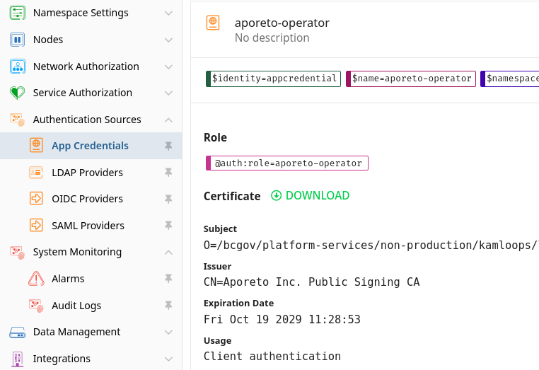

# Aporeto Console Authentication and Authorization
Aporeto can use many different types of authentication sources in order to provide access to the Console at https://console.aporeto.com. These could be standard Aporeto-managed accounts, or through a federated identity provider via OIDC or LDAP.

## OIDC
Aporeto is currently integrated with KeyCloak dev and prod instances. 
- When logging into the console, specify the OIDC account and provider information
  - **pathfinder-sso-dev**

  

  - **pathfinder-sso-prod**
  
 

## OIDC Configuration
The following OIDC configurations are in place: 
- sso-dev
  
  Or the configuration as code (exported from the **Data Explorer**)
  ```
  APIVersion: 0
  data:
    oidcproviders:
      - clientID: aporeto
        clientSecret: **[REMOVED]**
        default: true
        endpoint: 'https://sso-dev.pathfinder.gov.bc.ca/auth/realms/devhub'
        name: pathfinder-sso-dev
        subjects:
          - preferred_username
  ```

- sso-prod
  
  Or the configuration as code (exported from the **Data Explorer**)
  ```
  APIVersion: 0
  data:
    oidcproviders:
      - clientID: aporeto
        clientSecret: **[REMOVED]**
        default: true
        endpoint: 'https://sso.pathfinder.gov.bc.ca/auth/realms/devhub'
        name: pathfinder-sso-dev
        subjects:
          - preferred_username
  ```

## Authorizing Users
Each user that needs access to the platform must be added to the appropriate Authorization policy at the right level within Aporeto (coming soon). 

**Please note that all namespace authoriztion will be managed by a Custom Operator referenced [here](../architecture/design_decisions.md#namespace-automation)**


## App Credentials for Automation Components
App Credentials are created for our automation Operators to interact with the Aporeto control plane. These are generated upon installation of an enforcer or operator and are cryptographically signed. 
Each app credential is created with an expiry date (typically 10 years from the creation date), and each operator / enforcer stores this app credential in a kubernetes secret. This credential is used to obtain a shorter lived JWT token and the `apoctl` binary refreshes this token as required. 

App credentials can be revoked and refreshed as required. Policies should be put into place around refreshing these credentials more frequently, and these policies should be aligned with the government standard for SSL key rotation. 

