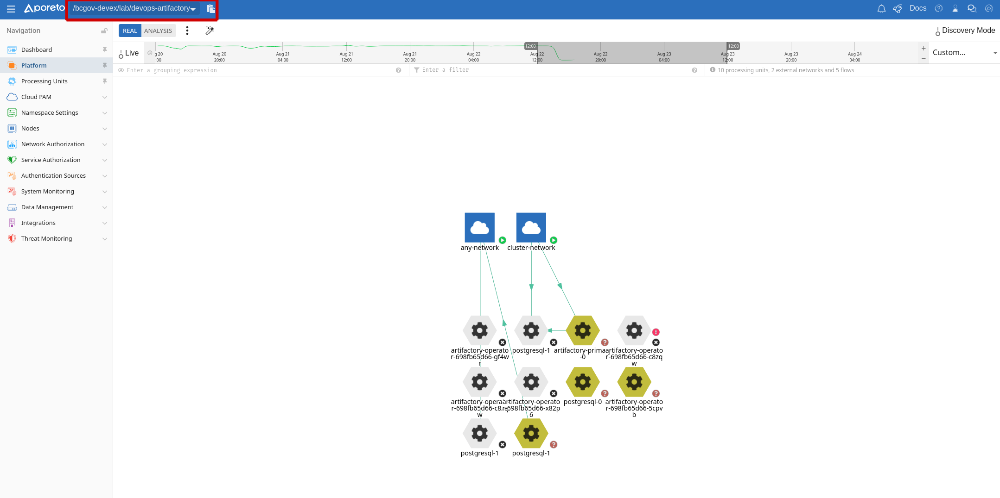
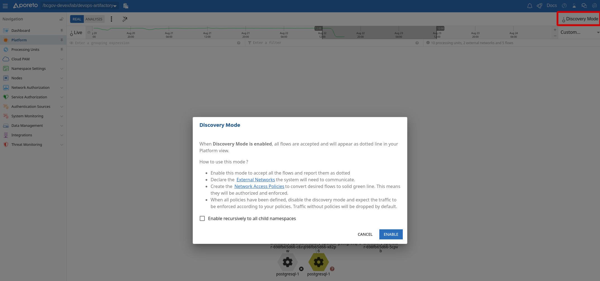
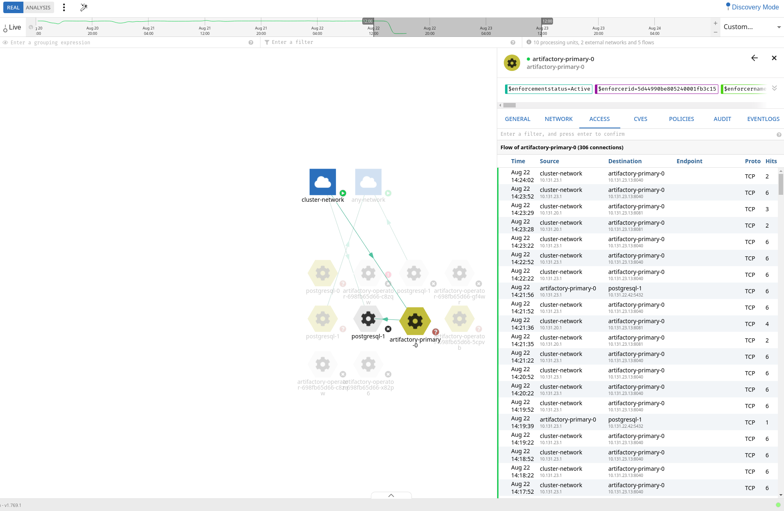
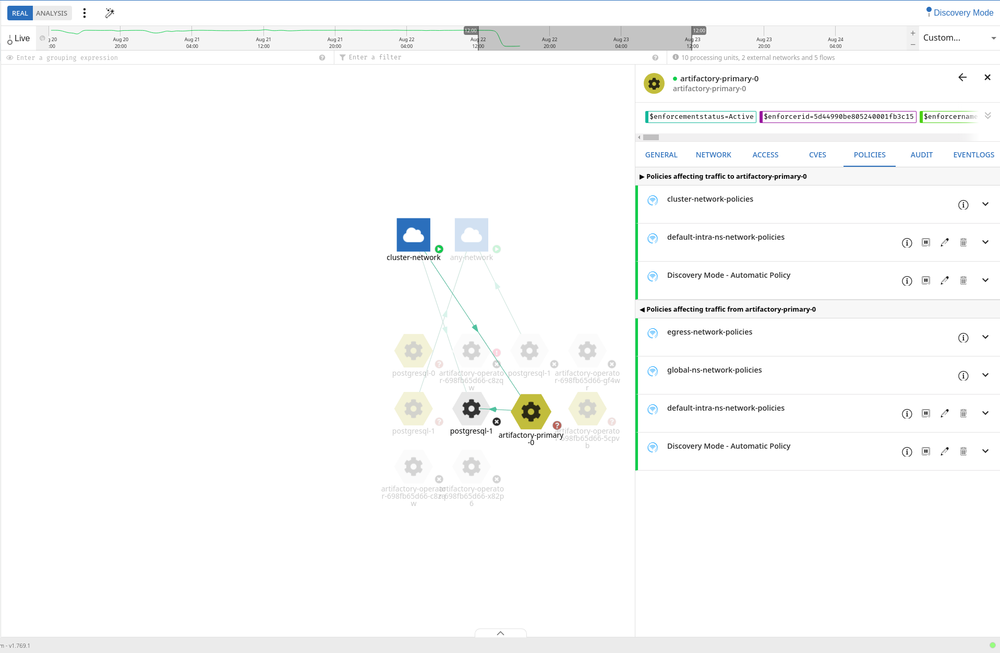
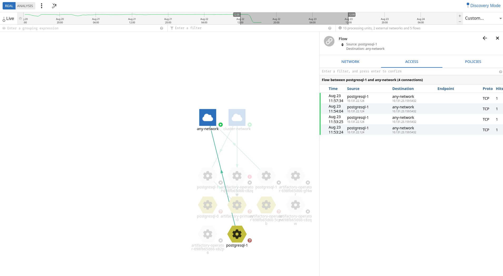
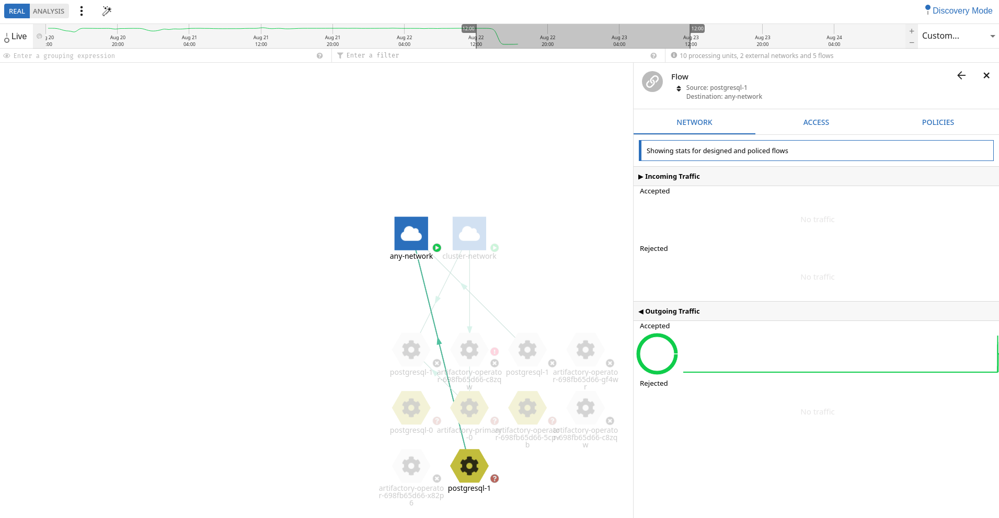
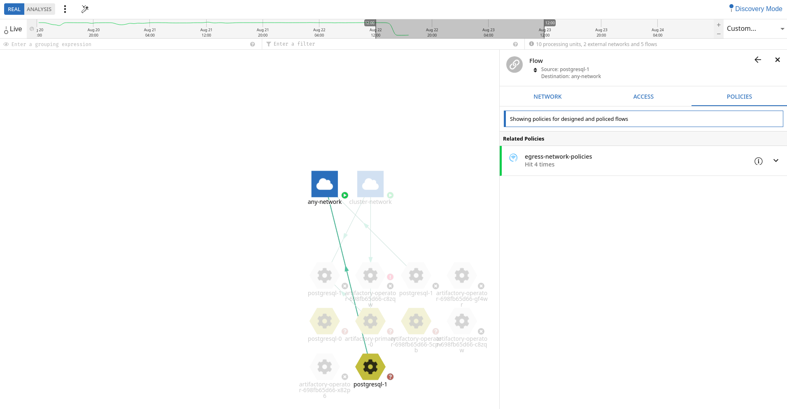

# Troubleshooting

**Note: The word "namespace" can apply either to an Aporeto Namespace or an OpenShift Project/Namespace. In Aporeto, there is a namespace hierarchy. The initial Aporeto namespaces are created to manage different "environments", with OpenShift Project/Namespaces mapped as child namespaces of a specific cluster.**


### Purpose
This document should cover standard steps used for troubleshooting connectivity issues where Aporeto is involved. This is a living document that should be updated as new processes are discovered. 

## Basic Troubleshooting

#### Using "Design Mode" for Debugging Connectivity
Design Mode can be used to allow all traffic in a specific namespace or across a namespace and all child namespaces. This can be useful while troubleshootingn connectivity issues. 

In order to enable design mode in the UI: 

- Navigate to the appropriate namespace level
  - For example, for the OpenShift project `devops-artifactory` select `/bcgov-devex/lab/devops-artifactory`
    - If attempting to troubleshoot inter-namespace communication, you need to select a level above the single namespace, such as /`bcgov-devex/lab`
  
  

  - Select **Discovery Mode** from the upper right corner and select enable

  
  
  - If required, change the date/time selector to ensure you see the Processing Units (PU's) you are intending to troubleshoot

  

  - Select the magic want to compute some policy suggestions
    - It's not recommended to use the computed suggestion. Ideally you can limit the labels to use (to keep policies simpler) and use the computed suggestion to craft the appropriate policy. 
 
  

When finished, rememeber to disable **Discovery Mode**. 

#### Identifying Details About PU's or Allowed/Denied Communications
Each PU or communication flow can be selected in the same `Platform` section of the UI in order to identify the source/destination addresses or which policies are affecting specific communications. 

- Details seen from a specific/selected PU





- Details seen from a specific/selected communication flow






#### Upgrading Components
The current deployment model uses Helm templating to manage each component. It's best to use this method for updates as well as there may be updates to the template with a new release. For example, to update the operator simply run the following again: 

```
helm fetch aporeto/aporeto-operator 
helm template ./aporeto-operator-*.tgz \
  --name aporeto-operator \
  --namespace $APORETO_NAMESPACE \
  | oc apply -f - -n $APORETO_NAMESPACE
```

#### The Last Resort - Removing the Enforcers
In the event that something appears "funky" with the Enforcers, it can be helpful to remove them as a last resort.

OpenShift/Kubernetes Labels are used to deploy enforcers through the daemonset. To remove an Enforcer from a node, change the label to "false". Change this back to "true" to redeploy the enforcer pod. 

For example: 
- Remove the enforcer from a specific node

```
oc label node ociopf-t-311.dmz aporeto-enforcerd=false --overwrite=true
```

- Perform the test again to determine if Aporeto was the the cause

- Redeploy the enforcer pod when appropriate

```
oc label node ociopf-t-311.dmz aporeto-enforcerd=true --overwrite=true
```
