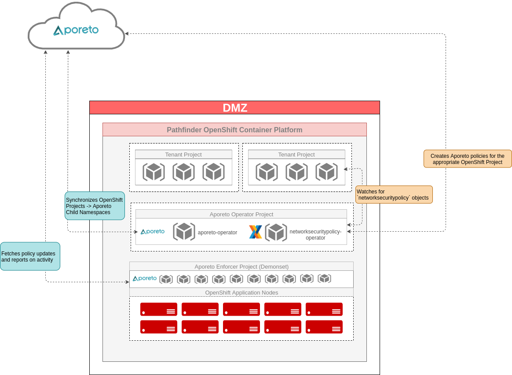

# Aporeto Playbook

### Requirements
- Namespace Preparation
The parent namespace must exist prior to running this playbook. A separate playbook [WIP](https://github.com/BCDevOps/platform-services/issues/176) controls all Aporeto namespace creation and access controls. 


- CLI tools
  - apoctl
  - helm

### Usage
This playbook can be used to install or uninstall Aporeto in each BCGov OpenShift environment. 
*Note: Only a single operator and set of enforcers must exist in an OpenShift cluster. Multiple implementations with this playbook will cause failures* 

#### Quickstart
- Set the user credentials in environment variables
  - These credentials are used to generate a temporary token for the install/uninstall process
  ```
  export APOCTL_USER=myuser
  export APOCTL_PASSWORD=mypassword
  ```

- Review/modify the inventory group vars as appropriate: 
  - For the Lab environment edit the [group_vars](group_vars/lab.yml)
  - For the Prod environment edit the [group_vars](group_vars/prod.yml)

- Review/modify the general [vars.yml](vars.yml) file for accuracy

- Ensure the system running this playbook is already logged in with appropriate credentials to OpenShift
    - The user running this playbook must had cluster-admin rights

- Run the playbook with the desired action
  - For installing the enforcers in the `lab`: 
    ```
    ansible-playbook -i lab aporeto.yml -e activity=install 
    ```
  - For removing the enforcers from the `lab`:
    ```
    ansible-playbook -i lab aporeto.yml -e activity=uninstall 
    ```


### Available Playbook Options
The Ansible playbook accepts a few switches: 
- **activity=install**
    - installs all components: 
        - aporeto operator
        - aporeto enforcers
        - base policies 
        - bcgov networksecuritypolicy operator
        - basic user policies

- **activity=upgrade**
    - applies the latest updates for the aporeto operator and enforcers 

- **activity=apply_policies**
    - applies all base policies that are required for OpenShift components to function
- **activity=bcgov-operator-install**
    - only installs the bcgov networksecuritypolicy operator

- **activity=apply_basic_user_policies**
    - creates egress internet and intra namespace policies
    - should only be used when cutting into prod
    - 

- **skip_basic_user_policies=true**
    - default is `false`
    - does not create / apply the egress and intra namespace policies

- **activity=uninstall**
    - removes all aporeto components including the CRD 
    - does not currently remove the rolebindings/clusterrolebindings for the operator
    - does not remove the bcgov networksecuritypolicy operator

### High Level Architecture
Architecture & design details are documented in the [architecture](../../architecture/readme.md) directory. 




### Playbook Flow: Install
The ansible playbook flow is as follows for installation:

```
ansible-playbook -i lab aporeto.yml -e activity=install
```

1. set_env.yml
    - Using "admin" aporeto credentials, obtain a temporary token to perform the remainder of the work
    - Obtain a list of OpenShift projects for later use

2. process_templates.yml
    - Using **group_vars**, render all of the base policies in yml format
    - Create the base policies in the aporeto control plane with `apoctl` 

3. namespace_preparation.yml
    - Create *Enforcer* and *Operator* OpenShift Projects
    - Create OpenShift service accounts with appropriate privileges
    - Create Aporeto Namespace in the Aporeto control plane
    - Create and Import the OpenShift enforcer profile and mapping into Aporeto
      - The enforcer profiles also specify projects that can be **ignored** by Aporeto. This list is maintained in the group_vars file. 
    - Create App Credentials for enforcer and aporeto-operator

4. install_aporeto_operator.yml
    - Using helm templates and the desired release (specified in group_vars) create the aporeto operator artifacts in OpenShift
      - *The aporeto-operator will start creating child namespaces which must be present when we create the basic user policies*

5. apply_policies.yml
    - Import all of the policies rendered in step 2
      - **external networks** are created and propogated to child namespaces for use within networkaccesspolicies
        - `any` is used for general internet access
        - `any-dns` is used such that all pods can perform proper dns lookups
        - `cluster-network` is used to reference the internal SDN network; kubelets are constantly performing healthchecks and require access to pods
        - `host-network` is used to identify any communication directly from an openshift node
        - `int-cluster-api-endpoint` references the internal kubernetes api endpoint
        - `ext-cluster-api-endpoint` references the public openshift api endopint
        - `multicast-vrrp` references the protocols needed for the ipfailover pods to communicate properly
      - **networkaccesspolicies** are created and propogated to child namespaces for basic OpenShift functionality to work
        - `api-server-communications` allows the apiservers to communicate with appropriate components such as the service-catalog
        - `cluster-api-endpoint` allows all pods to be able to communicate with the public OpenShift API endpoint
        - `cluster-network-policies` allows the OpenShift cluster-network to communicate with pods for things like readiness checks, liveliness probes, etc. 
        - `multicast-vrrp-permit` allows the pods in the default namespace to communicate with vrrp to each other
        - `dns-all-access` allows all pods to perform DNS lookups with udp/53 on any host
        - `global-ns-network-policies` allows any openshift project to communicate with projects that were deemed *global* from an openshift perspective 
        - `internet-egress` allows specific openshift projects to communicate with the internet
        - `internet-ingress-network-policies` allows ingress traffic into the OpenShift routers
        - `router-to-all-ns` allows the OpenShift routers to communicate with all namespaces

6. Identify the total amount of current policies in the namespace for later calculation in the basic user policy tasks

7. install_bcgov_networsecuritypolicy_operator.yml
    - **All files and templates in this task are located in [./files/bcgov-networksecuritypolicy-operator](./files/bcgov-networksecuritypolicy-operator)**
    - Generate an Aporeto App Credential for the operator and create the k8s secret
    - Render the deployment maniefest
    - Render the configMap so that `apoctl` is pre-configured
    - Render the clusterRoleBinding for the operator
    - Create all of the OpenShift objects required for the operator to function: 
      - CustomResourceDefinition
      - ServiceAccount
      - Role
      - ClusterRole (for user permissions)
      - ClusterRoleBinding
      - Deployment
      - ConfigMap

8. create_basic_policies.yml
    - Render 2 policies for every openshift project (except the exclusions)
      - internet-egress - allow all pods in the namnespace to communicate with the internet
      - intra-namespace-comms - allow all pods within a namespace to communicate with each other
    - Create each policy within each appropriate OpenShift project

9. monitor_policy_creation.yml
    - Query the Aporeto control plane and count the number of policies
    - Wait until the policy creation is nearly done before moving on

10. install_aporeto_enforcers.yml
    - Using helm templates and the desired release (specified in group_vars) create the aporeto enforcer artifacts in OpenShift
    - Label the desired nodes appropriately to accept the Enforcer pods


### Playbook Flow: Upgrade
The ansible playbook flow is as follows for installation:

```
ansible-playbook -i lab aporeto.yml -e activity=upgrade
```

1. install_aporeto_operator.yml
    - Using helm templates and the desired release (specified in group_vars) update the aporeto operator artifacts in OpenShift


2. install_aporeto_enforcers.yml
    - Using helm templates and the desired release (specified in group_vars) update the aporeto enforcer artifacts in OpenShift


### Playbook Flow: Uninstall

```
ansible-playbook -i lab aporeto.yml -e activity=uninstall
```
1. Fetch helm templates from the Enforcers and appropriate release (specified in group_vars) 

2. Remove Enforcer artifacts

3. Disable Aporeto Operator Syncing of Namespaces

4. Remove all Aporeto CustomResources (namespacemappings)

5. Remove Aporeto CustomeResourceDefinition

6. Fetch helm templates from the Operator and appropriate release (specified in group_vars) 

7. Remove operator artifacts

8. Remove Openshift Projects

9. Remove Aporeto Enforcer Node Labels


# Odds and Sodds
## Listing all Aporeto CRDs
In order to list Aporeto CRDs, run the following command: 

```
oc api-resources --api-group=api.aporeto.io -o name
```

## Todo
- [ ] Integrate OTP into this flow
- [ ] Sort out labels on appcred or appcred cleanup
- [ ] Create test/error for existing namespace
- [ ] Add error handling around existing namespace
- [ ] Determine whether to remove Aporeto namespace when uninstalling


## Helpful Notes
### Removing CRDs
All CR's pertaining to a CRD must be removed prior to the CRD being removed. 

- For example, to delete all networksecuritypolicies objects across all namespaces: 
```
for n in $(oc get networksecuritypolicies --all-namespaces | awk 'FNR>1 {print $1}'); do oc delete networksecuritypolicies.secops.pathfinder.gov.bc.ca --all -n  $n; done
```