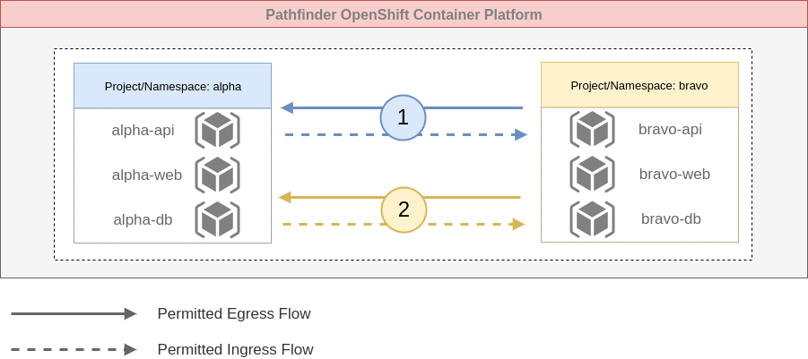
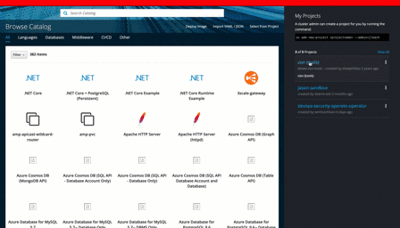

# Custom Network Security Policy Development

## Introduction

This tutorial is part of the [Developer Guide for Zero Trust Security Model](./README.md) and will guide you through creating application identities for each of your deployable components (pods) within your OpenShift Container Platform (OCP) namespaces as well as building custom application network security policy via `NetworkSecurityPolicy` (NSP) objects based on these identities to secure communications within the namespace and between the namespace and external components. 

By the end of the document you will be able to create policy to manage:

* External network ingress and egress;
* Namespace to the platform API (for builds)
* Namespace to namespace communication; and
* Pod to pod communication.


## How it Works

We've worked hard to keep this as simple as possible by allowing you to incorporate `NetworkSecurityPolicy` (NSP) in your OpenShift Container Platform (OCP) deployment manifests.

__Application Identity__

You build application identity by adding labels to the metadata portion of your OCP deployment manifests. For example, in the deployment manifest excerpt below the combination of labels build a unique application identity which can be referenced in the NSP to permit communication.

Its worth noting that each deployment config should have at least one label that uniquely identifies it. In the example below this is accomplished using the `role=api` label; no other deployment will use this specific label. See the **Application Identity Naming Convention** section below for best practices. 

```yaml
- kind: DeploymentConfig
  apiVersion: v1
  metadata:
    name: "${NAME}"
    labels:
      name: "${NAME}"
      app: ${APP_NAME}
      role: api
      env: production
    annotations:
      description: Defines how to deploy the application server
  spec:
    strategy:
  ...
```

**🤓 ProTip**

* Add the `role=` label to each deployment config of your manifest to uniquely identify the pods.


## Application Identity Naming Convention

The naming convention you use for labels that allow you to build your application identity should be no more complicated than necessary.

| Label | Values        | Description     |
| ----- |:-------------:|:---------------|
| app  | name           | Use the `app` label to group all your deployment components. This *won't* be unique. |
| role | frontend, backend, database, etc.| Use the `role` label to uniquely identify a pod by its purpose. |
| env  | dev, test, prod | Use the `env` label to correlate with the namespace the application runs in. |

In the samples below two deployments are configured in an deployment manifest. The values for `NAME` and `APP_NAME` are parameters making them common to both the Web and API deployments. This is a common convention used in OCP (and k8s) deployments.

The `env` label will change based on the namespace the deployment targets and the `role` uniquely identifies the deployment.

**Web**
```yaml
  metadata:
    name: "${NAME}"
    labels:
      name: "${NAME}"
      app: ${APP_NAME}
      role: web
      env: production
```

**API**
```yaml
  metadata:
    name: "${NAME}"
    labels:
      name: "${NAME}"
      app: ${APP_NAME}
      role: api
      env: production
```

**🤓 ProTip**

* K.I.S - Keep It (your labels) Simple; don't try and outsmart yourself.
* Where possible use the naming convention proposed here for uniformity across projects.

## Custom Network Security Policies

The network security policies below will provide most teams enough to get up and running in short order. Customize them with labels or template parameters as needed. If you find the sample policy below does not suite your needs contact platform services to help create more advanced access policy.

In the subsections below we'll use one or more tags to identify the source and destination systems. The relevance if `source` and `destination` is that the application identified in the `source` will be able to open a network connection to the application identified in `destination`; Once a connection is open then data is able to flow bidirectionally.

| Field | Required | Description     |
| ----------- |:--------:|:---------------|
| name        | YES      | Use this field to uniquely identify policy. Check out the [naming conventions](../architecture/design_decisions.md#policy-naming-conventions)  for custom network security policies. |
| description | YES      | A brief description of what the policy does. |
| source      | YES      | Tags used to identify the application that can initiate a network connection. |
| destination | YES      | Tags used to identify the application that receives the network connection.

See the [`samples` file](./sample/quickstart-nsp.yaml) accompanying these instructions for more information.

### Namespace to OCP API

The OCP has an internal API that your environment needs to communicate with to run deployments and for other internal mechanics to work. Change the source namespace in the sample below and apply it.

```yaml
apiVersion: secops.pathfinder.gov.bc.ca/v1alpha1
kind: NetworkSecurityPolicy
metadata:
  name: custom-pods-to-api-[APP_NAME]
spec:
  description: |
    Allow pods to talk to the internal OCP api 
  source:
    - - $namespace=handy-dandy-prod
  destination:
    - - int:network=internal-cluster-api-endpoint
```

### Intra-namespace

This sample policy is used to allow pods to communicate within a given namespace; there is no need to supply the name of the namespace for this policy by default as it is implied. Create a policy similar to this one for each system that needs to open a network connection to another system. In a simple application this would typically include:

* Web to API
* API to Database

```yaml
apiVersion: secops.pathfinder.gov.bc.ca/v1alpha1
kind: NetworkSecurityPolicy
metadata:
  name: custom-web2api-permit-[APP_NAME]
spec:
  description: |
    allow the Web pod(s) to communicate to the API pod(s).
  source:
    - - app=myapp
      - role=web
      - env=production
  destination:
    - - app=myapp
      - role=api
      - env=production
```

### External Network to Namespace 

This sample policy is used to allow external networks to communicate with pods; typically use this type of policy to accept connections from the the Interweb 🧐. Create a policy similar to this one for each component that needs to **receive** connections from the Internet.

The sample below allows the Web pod(s) to accept connections to from the Internet.

```yaml
kind: NetworkSecurityPolicy
apiVersion: secops.pathfinder.gov.bc.ca/v1alpha1
metadata:
  name: custom-external-ingress-[APP_NAME]
spec:
  description: |
    Allow the frontend (web) to receive connections from the Internet.
  source:
    - - ext:network=any
  destination:
    - - app=myapp
      - role=web
      - env=production
```

**🤓 ProTip**

* If some of your application components are hosted outside of Opehsift, check the `ExternalNetwork` [here](./ExternalNetwork.md) for sample policies (coming soon).

### Namespace to External Network 

This sample policy is used to allow pods to communicate with an external network; typically use this type of policy to talk to the Interweb 🧐. Create a policy similar to this one for each system that needs to **initiate** connections to the Internet or other parts of the BCGov (SPANBC) network.

The sample below allows the API pod(s) to open connections to any system on the Internet.

```yaml
kind: NetworkSecurityPolicy
apiVersion: secops.pathfinder.gov.bc.ca/v1alpha1
metadata:
  name: custom-internal-egress-[APP_NAME]
spec:
  description: |
    Allow the backend (API) to open connections to the
    Internet.
  source:
    - - app=myapp
      - role=api
      - env=production
  destination:
    - - ext:network=any
```

### Namespace to Namespace

This sample policy is used to allow pods to communicate across namespaces; typically use this type of policy to talk to other applications hosted on the OCP. Create a policy similar to this one for each system that needs to **initiate** connections to another OCP namespace. The owner of the `destination` namespace will need a similar policy to allow incoming connections from the `source` namespace. 

**:point_up: Note**
> The prerequisite for the namespace to namespace network security policy is for the connecting namespaces to either have API endpoints exposed as routes in Openshift or to have a network join created to enable communication between the namespaces on the network level (Openshift 3.11 only).

The sample below allows the API pod(s) to open connections to a specific pod(s) in a different namespace.

```yaml
kind: NetworkSecurityPolicy
apiVersion: secops.pathfinder.gov.bc.ca/v1alpha1
metadata:
  name: custom-ns2ns-comms-[APP_NAME]
spec:
  description: |
    Allow the backend (API) to open connections to backend (API) pod(s)
    in the handy-dandy-prod namespace.
  source:
    - - app=myapp
      - role=api
      - env=production
  destination:
    - - app=theirapp
      - role=api
      - env=production
      - $namespace=handy-dandy-prod
```

#### Bidirectional Namespace to Namespace Communication
When starting out with communication between namespaces you may need to start with a more permissive policy. For bidirectional namespace communication there are 2 flows of traffic to consider: 
1. Communication to and from **Project Alpha** 
  - Pods from project **Alpha** initiating an **egress connection** to pods in project **Bravo** 
  - Pods from project **Alpha** accepting an **ingress connection** from pods in project **Bravo**
2. Communication to and from **Project Bravo**
  - Pods from project **Bravo** initiating an **egress connection** to pods in project **Alpha** 
  - Pods from project **Bravo** accepting an **igress connection** from pods in project **Alpha** 




This can be configured in a single NetworkSecurityPolicy object. Apply the following yaml to each namespace: 

```yaml
apiVersion: secops.pathfinder.gov.bc.ca/v1alpha1
kind: NetworkSecurityPolicy
metadata:
  name: custom-allow-alpha-and-bravo-to-talk-[APP_NAME]
spec:
  description: |
    Allow all pods in alpha and bravo to communicate
  source:
    - - $namespace=bravo
    - - $namespace=alpha
  destination:
    - - $namespace=alpha
    - - $namespace=bravo
```
:exclamation: The above policy is very permissive. Once your application flow patterns have been created, adjust the NetworkSecurityPolicy objects for a more specific and restrictive communcation policy as suggested in the beginning of this section. 

**🤓 ProTip**

* Use enough labels to uniquely identify the source and destination pods or processing units. Try not to rely solely on generic labels like `env=production` or `app=theirapp`.

* Use YAML syntax for the **AND and OR** logical operators in the NSP; 
  - using the **AND** operand is shown below, ensuring that the destination PU **must match all 3 specified labels**
    ```
      destination:
      - - role=api
        - app=fpo
        - env=dev
    ```
  - using the **OR** operand is shown below, ensuring that the destination PU **must match at least 1** of the defined labels
    ```
      destination:
      - - role=api
      - - role=web
    ```


## Usage

Creating a Zero Trust security model is relatively easy; here's how you'll do it: Create your policy based on the information above; then add it to your OCP deployment manifest; and finally, deploy your application. Lets go over them in more details:

**Step 1 - Add Labels**

Open your deployment manifest and add labels to your `DeploymentConfig` sections to uniquely identify each one:


In this illustration I have a minio deployment that I add the label `role: objstore` to and an API deployment I add `role: api` to.

**Step 2 - Remove Existing Policy**

If your running in OCP 3.11 then, when we installed the security components, 3 base policies were added to all namespaces to keep all environments running as expected. Before adding any custom policy **you must remove the pre-installed policies**.

To do this see these two sections below:

* [Check it Out](#check-it-out)
* [Remove It](#remove-it)

**Step 3 - Add Policy**

In the same deployment manifest begin adding your NSP:


In this illustration I copy the NSP directly from this tutorial and modify it so that my API can talk to the minio object store.

**Add Step 4 - Test It**

Once you policy is in place you can test it by going to one of the Pods in the deployment:

```console
oc rsh my-pod-name-here
```

And running a shell command to test connectivity:

```console
timeout 5 bash -c "</dev/tcp/google.ca/443"; echo $?
```

Replace `google.ca` with the service of the pod you wish to connect to and change port `443` to the port your pod exposes for connectivity.

Another way to test your policy is to use [this test script](https://github.com/BCDevOps/openshift-developer-tools/blob/master/bin/testConnection). It will allow you to test connectivity between your pods in a semi-automated way.

### Deploy It

To deploy your policy just do thinks as you normally would:

```console
oc process -f deploy.yaml | oc create -f -
```

**🤓 ProTip**

* You can create manifest files with just your policy in it and deploy them (you still need labels on your pods) with the `oc apply -f my-nsp.yaml`.


### Check it Out

There are a few ways you can check out your existing NSP.

**CLI - oc**

The best and most simple way to view your existing NSP is to use the `oc` command line interface. Run the following command to see installed policy:

```console
oc get networksecuritypolicy
```

This should produce output similar to the following:

```console
NAME                                         AGE
egress-internet-devex-von-tools              5d
int-cluster-k8s-api-permit-devex-von-tools   5d
intra-namespace-comms-devex-von-tools        5d
```

If you want to dig a little deeper you can specify one of the policies to fetch and output it in well formated YAML. Run the following command to fetch a specific policy:

```console
oc get networksecuritypolicy egress-internet-devex-von-tools -o yaml
```

This command produces detailed output similar to the following. You only need to focus on the `spec:` stanza to inspect the rules of the NSP. The other information can safely be ignored.

```yaml
apiVersion: secops.pathfinder.gov.bc.ca/v1alpha1
kind: NetworkSecurityPolicy
metadata:
  annotations:
    kubectl.kubernetes.io/last-applied-configuration: |
      {"apiVersion":"secops.pathfinder.gov.bc.ca/v1alpha1","kind":"NetworkSecurityPolicy","metadata":{"annotations":{},"name":"egress-internet-devex-von-tools","namespace":"devex-von-tools"},"spec":{"description":"allow devex-von-tools to talk to the internet\n","destination":[["ext:network=any"]],"source":[["$namespace=devex-von-tools"]]}}
  creationTimestamp: "2019-10-02T15:28:48Z"
  finalizers:
  - finalizer.secops.pathfinder.gov.bc.ca
  generation: 1
  name: egress-internet-devex-von-tools
  namespace: devex-von-tools
  resourceVersion: "397972060"
  selfLink: /apis/secops.pathfinder.gov.bc.ca/v1alpha1/namespaces/devex-von-tools/networksecuritypolicies/egress-internet-devex-von-tools
  uid: 54615585-e529-11e9-81f0-00505683b471
spec:
  description: |
    allow devex-von-tools to talk to the internet
  destination:
  - - ext:network=any
  source:
  - - $namespace=devex-von-tools
status:
  conditions:
  - ansibleResult:
      changed: 3
      completion: 2019-10-07T16:55:09.793987
      failures: 0
      ok: 11
      skipped: 0
    lastTransitionTime: "2019-10-02T16:50:52Z"
    message: Awaiting next reconciliation
    reason: Successful
    status: "True"
    type: Running
```

**Web - console**

Open the OCP administration console and navigate to the namespace containing the NSP you want to inspect. Next, go to Resources -> Other Resources and use the dropdown to select 'Network Security Policy'.



### Remove It

To remove network policy you can again use the CLI or Web console. For the CLI just use the `delete` verb in the command you used to inspect policy

```console
oc delete networksecuritypolicy egress-internet-devex-von-tools -o yaml
```

From the Web, again navigate to the NSP and use the "Actions" drop down to select "Delete".

### Troubleshooting

See the `Support` section of the main help document [here](./README.md).
