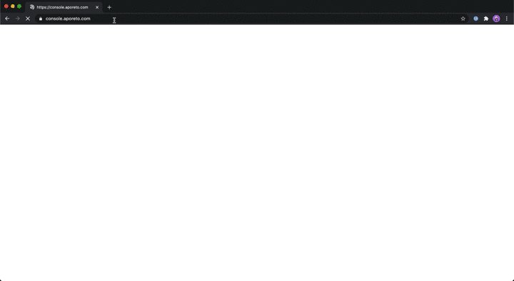

# Developer Access to the Aporeto Console

## Introduction 
In order to gain access to the Aporeto Console to view `NetworkSecurityPolicies`, `ExternalNetworks`, Processing Units (Pods - PUs), and Network Flows between PUs you must create a `ConsoleAuthorizationPolicy` (`cap`) Custom Resource within your OpenShift 4 namespace. 

>**Note:** The `ConsoleAuthorizationPolicy` or `cap` for short must be named `viewers`, and any other name will be ignored. 

## ConsoleAuthorizationPolicy Setup  

### Check if the policy already exists

```sh
oc -n ${NAMESPACE} get consoleauthorizationpolicies
oc -n ${NAMESPACE} get caps
```

### Create a `cap` using the template below or by modifying the existing resource:  

```yaml
apiVersion: security.devops.gov.bc.ca/v1alpha1
kind: ConsoleAuthorizationPolicy
metadata:
  name: viewers
spec:
  users:  
    - <github_id>@github
```

#### Apply the `cap` in your OpenShift 4 namespace

```sh
oc -n ${NAMESPACE} apply -f ${NAMESPACE}-cap.yaml
```

#### Get the status of the `cap` in your OpenShift 4 namespace

```sh
oc -n ${NAMESPACE} describe -f ${NAMESPACE}-cap.yaml
```

## Logging into the Aporeto Console

Browse to https://console.aporeto.com and Select "Sign-in with OIDC" from the drop down menu. Enter `bcgov` in the "Account or namespace" field.



### Identify your Aporeto Namespace

| Cluster | Aporeto Base Namespace |
|---------|----------------|
| Silver | /bcgov/platform-services/production/kamloops/silver |
| KLAB | /bcgov/platform-services/non-production/kamloops/klab |

Take the `Aporeto Base Namespace` for the `Cluster` your OpenShift Namespace is in and add your OpenShift namespace to the end of it to get your `Aporeto Namespace`. 

#### Example

**OpenShift Cluster:** Silver  
**OpenShift Namespace:** \<licensePlate\>-tools  
**Aporeto Base Namespace:** /bcgov/platform-services/production/kamloops/silver  
**Aporeto Namespace:** /bcgov/platform-services/production/kamloops/silver/\<licensePlate\>-tools

### Access your Aporeto Namespace

1. Copy your `Aporeto Namespace` including the `Aporeto Base Namespace`. 
2. Go to the Search Bar in the Aporeto Console
3. Ignore the Authorization Error (This is expected -- you do not have access to search for namespaces)
4. Paste your `Aporeto Namespace` into the Search Bar and Press Enter
5. (Optional) Return to the Search Bar to add your namespace to your favorites by clicking the pin icon at the end of your namespace
6. Click `Platform` in your side bar to view a mapping of the Processing Units (PUs / Pods) in your namespace and their current network flows.

> TODO: Make this gif match the example


**🤓 ProTip**

* You can also bookmark the links to your aporeto namespaces but you may need to go to `https://console.aporeto.com/` to login before accessing the links.

### What now?

`NetworkSecurityPolicies` (`nsp`) and `ExternalNetworks` (`en`) can be viewed by expanding the Network authorization menu in the sidebar and selecting either Network Policies or External Networks. `NetworkSecurityPolicies` and `ExternalNetworks` defined within OpenShift 4 will appear here when the NSP Operator has processed them successfully. If you don't see your `nsp` or `en` listed please check the status of the Custom Resources with an

```sh
oc -n ${NAMESPACE} describe nsp <resource_name>
oc -n ${NAMESPACE} describe en <resource_name>
```

Processing Units (PUs), which represent your pods or applications, can be viewed either from the Platform or Processing units menu items in the sidebar. You can select any PU to view the tags and metadata associated with it. These tags can be used when writing your `NetworkSecurityPolicies` to give you greater control and flexibility to meet your application's security requirements.

## Demo

Coming Soon!
