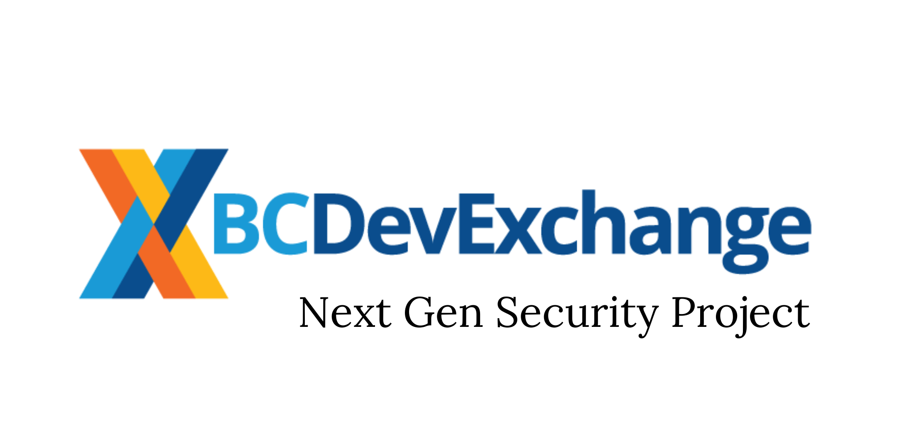
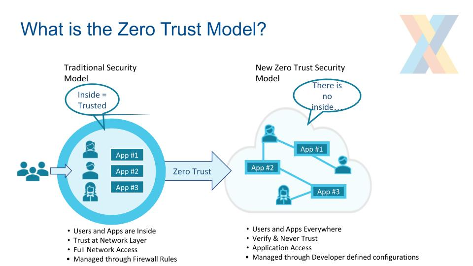
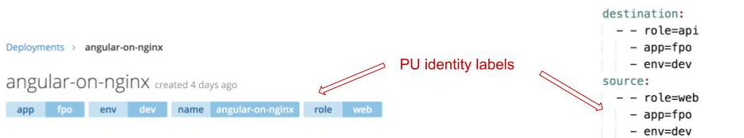
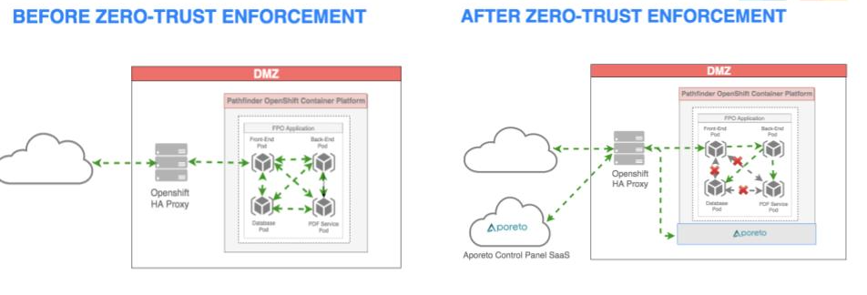
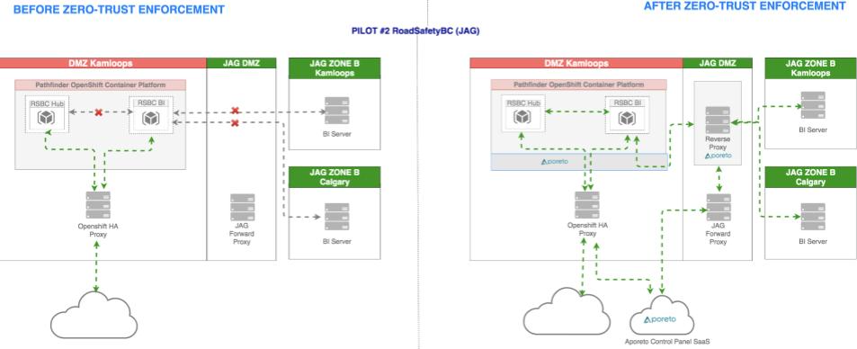
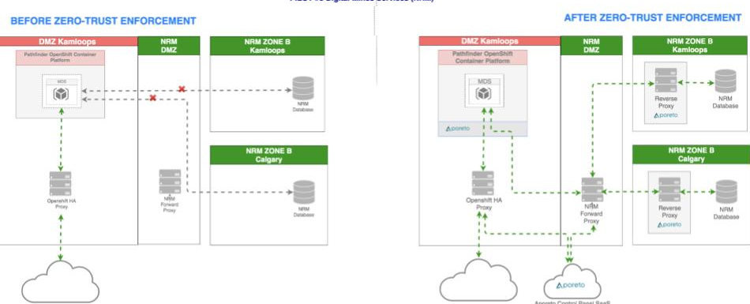

## Workshop: Working with Zero-Trust Security Model in Openshift

##### Dec 2-3, 2019

### Next Gen App Security Project: Building DevSecOps for BC Gov

* Quick project overview

    * Started in Aug 2019, budget $1.35M, 4 people core Tech Team
    * Testing new security model with real-life applications - 3 production pilots in progress (JAG and NRS)

* Problem Statement

    * Adding Sec to DevOps : the security of the Openshift platform must be improved in order for ministry teams to continue utilizing current applications and to satisfy the demand for new ones.
    * Expanding Opinionated Developer Toolkit : real-time container scanning and secret management add-ons
    * Continuous STRA and PIA compliance check for platform applications

* Important Milestones:

    * Oct 8, 2019 - Aporeto software installed on Openshift
    * Oct 22, 2019 - Zero-Trust Network Security Model enabled
    * Oct 23, 2019 - Pilot #1  - FPO - complete

### What is the Zero Trust Model?



### Why Aporeto?

* Why Kubernetes needs Zero Trust Networking?

  * In K8S environments IP addresses are dynamically assigned and carry no meaningful information
  * Applications have a much more rich identifier that includes their context (ie. metadata about the running
instance)

* Aporeto’s unique approach to Zero Trust Cloud Security

  * Implemented on levels 3-7 of OCI Model
  * Flows are authorized through network security policies based on application identity instead of IP addresses

* Every communication is authenticated , then authorized and optionally transparently encrypted
  * Provides seamless distributed policy management across Kubernetes multi-cluster and container
environments - on-prem and public clouds
  * Can extend into non-Kubernetes environments such as legacy infrastructure in network zones


### Our Implementation

* Aporeto Enforcers
  * Enabling the enforcement of network security policies
  * Distributed in key control points of the network - Openshift cluster nodes, HA proxies in Zone B
  * Installed and maintained by DXC Ad Sol

* Aporeto Network Security Policy
  * Network Security rules defined at multiple levels (hierarchy based)
  * Application specific policies in YAML format
    * inherit rules from parent levels
    * Uni-directional, e.g. for bi-directional flow must be enabled on both sides of the connection
    * Developer-controlled via NetworkSecurityPolicy Custom Resource Definition (CRD)
    * Automatic backups to a private repo for restore and audit purposes

* Aporeto Security Orchestrator (aka Control Plane, aka Console)
  * Available as SaaS on GCP https://console.aporeto.com
  * Responsible for policy management, data collection, analytics, and UI for policy visualization
  * Read-Only Access for Developers is coming soon


### Impact on OpenShift Platform Users

* Guiding Implementation Principle

    * Increased security and compliance built into the Platform balanced with flexibility in adoption andbcontrol by developers (ie. self-service Network Security Policy management)

* Existing applications
  * deployed to OCP prior Oct 8, 2019
  * pre-populated with 3 basic network security policies to operate “as is”
  * No impact until OCP 4.2 upgrade

* New applications
   * deployed to OCP after Oct 8, 2019
   * No communication flows allowed by default (ie. Zero-Trust)
   * Require custom network security policies to be developed to enable communications

### Custom Network Security Policy

* Configuration files used by Aporeto to authenticate and authorize communication flows

* Added to an application as Custom Resource Definition (CRD) NetworkSecurityPolicy ” in YAML format

* Special operator translates YAML to Aporeto native language behind the scene

* Identity labels uniquely describe each Processing Unit ( authentication ) that the policy must apply to

* Custom Network Security Policy describes what communication flow - ingress and egress - is allowed for the Processing Unit ( authorization )



### Network Security Policy Ownership Model

### (Work in Progress)


### Base Custom Network Security Policies

* Intended as a workaround to allow existing applications to continue functioning “as is” with new Zero Trust Model enabled on the Platform
  * **Are NOT the best practice for application’s network security!**

* Focuses on allowing 3 flows:
  * Within the namespace - pod to pod communications
  * From the namespace to the K8S/OpenShift API - for builds/deployments/etc.
  * From the namespace to Internet and external networks - for egress traffic

* **Must be included in the app’s deployment config in order to migrate to OCP 4**

* **Must be replaced with the policies matching application’s unique security requirements** 

### Intra-Namespace: Pod-to-Pod Base Policy 

* Allows all pods in a namespace to
communicate between themselves
* Not all pods need to talk to all pods -> policy
override leads to better security
* Policy Override Tips:
  * For bi-directional flow each pod in the pair must
have a matching policy
  * Some pods need to talk to themselves!
* Some best practices:
  * Only backend pod can talk to the database pod -
uni-directional
  * Only front-end pod can talk to the backend-end
pod - uni-directional (see Example)
  * Database pod shouldn’t need to initiate any
requests.

Example: 
```
- kind: NetworkSecurityPolicy
    apiVersion: security.devops.gov.bc.ca/v1alpha
    metadata:
        name: intra-namespace-comms-uwsgva-dev
        labels:
            name: ${NAME}
            app: ${APP_NAME}
            env: ${TAG_NAME}
    spec:
        Description: Allow the namespace uwsgva-dev pods to talk to each other.
source:
        destination:
         - - $namespace=uwsgva-dev
        source:
         - - $namespace=uwsgva-dev
```
Replace with custom policy for each required pod to pod communication. 

**Tip: A policy is only required on the connection initiating side, i.e. Pod A has a policy that allows it to initiate a connection to Pod B and Pod B will be able to respond to it. If Pod B needs to initiate a connection to Pod B, then it will need a separate policy.**

Example:
```
- kind: NetworkSecurityPolicy
    apiVersion: security.devops.gov.bc.ca/v1alpha
    metadata:
        name: intra-namespace-comms-uwsgva-dev
        labels:
            name: ${NAME}
            app: ${APP_NAME}
            env: ${TAG_NAME}
    spec:
        Description: Allow the frontend (web) to talk to the api pod.
        source:
            - - role=web
            - app=${APP_NAME}
            - env=${TAG_NAME}
        destination:
            - - role=api
            - app=${APP_NAME}
            - env=${TAG_NAME}
```
**Tip: "--" in YAML means "OR". "-" means "AND".** The source above translates to "apply this policy to a pod that has a label "role=api" AND the label "app=${APP_NAME}" AND the label "env=${TAG_NAME}".


### Namespace-to-External-Networks Base Policy 


* Allows all pods in a namespace to access Internet
and external networks (egress)
* Not all pods need to talk to Internet -> policy
override leads to better security
* Policy Override Tips:
  * Restrict access to Internet as much as possible
  * Access from Internet (ingress) to a pod is governed
by OCP Routes
* Some best practices:
  * Only keep this policy in -TOOLS namespace to
allow builds (access to GitHub, etc), remove from
other namespaces

Example:
```
- kind: NetworkSecurityPolicy
    apiVersion: security.devops.gov.bc.ca/v1alpha
    metadata:
        name: namespace-to-external-network-aajsw-dev
        labels:
            name: namespace-to-external-network
            env: ${ENV_NAME}
    spec:
    description: Allow all pods in the namespace to access the internet.
    source:
        - - $namespace=aajsw-dev
    destination:
        - - ext:network=any

```
Replace with a custom policy for each pod that is required to connect to Internet/external networks.

Example:

```
- kind: NetworkSecurityPolicy
    apiVersion: security.devops.gov.bc.ca/v1alpha
    metadata:
        name: pod-to-external-network-aajsw-dev
        labels:
            name: pod-to-external-network
            env: ${ENV_NAME}
    spec:
    description: Allow the front-end pod in the namespace to access the internet.
    source:
        - - role=web
        - app=${APP_NAME}
        - env=${TAG_NAME}
    destination:
        - - ext:network=any
```


### Namespace-to-K8S-API Base Policy 

* Allows all pods to talk to the internal
Kubernetes API
* Required for builds, deployments and
auto-scaling
* Some best practices:
  * Use the Cluster API endpoint for quick
testing
https://kubernetes.default.svc.cluster.local:443
  * Run regular builds and deployments for
thorough testing

Example:
```
- kind: NetworkSecurityPolicy
    apiVersion: security.devops.gov.bc.ca/v1alpha
    metadata:
        name: int-cluster-k8s-api-comms-aajsw-dev
    labels:
        name: pods-to-api
        app: ${APP_NAME}
        env: ${TAG_NAME}
    spec:
        description: Allow pods in the namespace to talk to the internal api
        source:
            - - $namespace=aajsw-dev
        destination:
            - - int:network=internal-cluster-api-endpoint
```
Replace with a custom policy for each pod that is required to connect to internal Kubernetes API.

Example:
```
- kind: NetworkSecurityPolicy
    apiVersion: security.devops.gov.bc.ca/v1alpha
    metadata:
        name: int-cluster-k8s-api-comms-aajsw-dev
    labels:
        name: pod-to-api
        app: ${APP_NAME}
        env: ${TAG_NAME}
    spec:
        description: Allow patroni database pod in the namespace to talk to the internal api
        source:
            - - role=database
            - app=${APP_NAME}
            - env=${TAG_NAME}
        destination:
            - - int:network=internal-cluster-api-endpoint
```
### Custom Network Security Policy Development

* Identify custom security requirements/rules for your application (whiteboard network diagrams)
* Assign identity labels t o all processing units, e.g. pods the policies will apply to
* Develop custom network security policy to implement the rules
* Replace the default base policies with the the custom policies in a non-prod environment
* Test and repeat in all environments including -TOOLS!
  * Check out [testConnection.sh](https://github.com/BCDevOps/openshift-developer-tools/blob/master/bin/testConnection) script in openshift-developer-tools repo in BCDevOps and
[testConnections.txt](sample/testConnections.txt) with sample test endpoints in platform-services/security repo
* Store policies in the application’s repo in the folder corresponding to the pod it applies to and that initiates the connection
    Check the [FPO](https://github.com/bcgov/Family-Protection-Order) repo for examples. Search for "NetworkSecurity" in the repo.
* Follow [Policy Naming Conventions](https://github.com/BCDevOps/platform-services/blob/master/security/aporeto/architecture/design_decisions.md#policy-naming-conventions) listed in Dev Guide for NetworkSecurity in DevHub, i.e. <flow
description>-<app-namespace>-<environment>, and best practices described above.


### Our Heroes (aka Pilots)

* Have specific security requirements that cannot be met by 3 basic policies

* Help the project team to test out different design patterns for the benefit of the entire developer community

* **Family Protection Order (FPO) pilot** by AG

    * Close off communications within an OCP namespace

* **RoadSafetyBC pilot** by RSI

    * Enable OCP namespace to namespace communication and into the JAG Zone B

* **Mines Digital Services** by NRM

    * Enable the OCP namespace into the NRM Zone B communications

* **BC Registries pilot** (accidental)
    * Enable OCP namespace to namespace communication
    * When Zero-Trust Model was enabled on the Platform, BC Registries namespaces lost the ability to talk to each other and required a namespace-to-namespace policy in order to enable this communication again.

* (Future pilot) **EPIC Cloud Migration Pilot** by NRM
    * Enable the OCP namespace into the public cloud (Azure) communication

### Family Protection Order (FPO) Pilot: Intra-Namespace Flows Design Pattern

https://github.com/bcgov/Family-Protection-Order



### RoadSafetyBC Pilot: Namespace-to-Namespace and to JAG Zone B Flow Design Pattern



### Mines Digital Service Pilot: Namespace to NRM Zone B Flow Design Pattern



### Aporeto Console UI

* Available at https://console.aporeto.com

* Access for developers in COMING SOON!

* Helpful for policy visualization and troubleshooting

* Console overview video - https://youtu.be/eirVDyPMTwM


### Where to find help?

* Check out [Developer Guide](https://developer.gov.bc.ca/Developer-Guide-to-Zero-Trust-Security-Model-on-the-Platform) for Network Security in DevHub

* Ask for help in Rocketchat
  * **#devops-sos** - Use this channel when things are on fire :fire: and you need
immediate help to resolve a production problem
  * **#devops-security** - Use this channel to tap into the top-notch OCP community for
help
  * Reach out to Next Gen Security team ( olena.mitovska, jason.leach or
justin.pye ) directly if your project has complex security requirements e.g. some
components are hosted outside the Platform

### Lab Time!

* Prerequisites
  * Admin access to a non-production namespace in the Openshift Platform
  * Have the [sample policy file](sample/quickstart-nsp.yaml) handy
  * Clone https://github.com/BCDevOps/openshift-developer-tools and include /bin in your
PATH
  * Copy [testConnection.txt](sample/testConnections.txt) file from platform-services repo, update with a list all deployments within your namespace

### Fun with Custom Network Security Policy

* View 3 base policies in your namespace (**oc login ... first**)
 ``` 
  oc get networksecuritypolicy
  oc describe networksecuritypolicy <POLICY_NAME>
  oc get networksecuritypolicy <POLICY_NAME> -o yaml > temp/<POLICY_NAME>.yaml (repeat for each)
```
* Remove the base policies
```  
  oc delete networksecuritypolicy <POLICY_NAME> (repeat for each)
```
* Test connectivity
```
 ./testConnection -n <NAMESPACE_NAME> -p <DEPLOYMENT_NAME> -f <PATH_TO>/testConnections.txt
```
* Recreate the base policies
  * Open the sample policy file
  * Copy a sample policy into a local YAML file named **custom-<POLICY_NAME_IN_FILE>-<NAMESPACE_NAME>.yaml** and update with your details
```
oc apply -f networksecuritypolicy <YAML_FILE>.yaml
```
* Test again!


## Feedback & Questions

* We are looking to hear back about your experience with custom  network security policy development including lessons learned, tip and tricks and the idea for how to make the developer experience on the Platform better. Post feedback in **#devops-security** Rocketchat channel.
