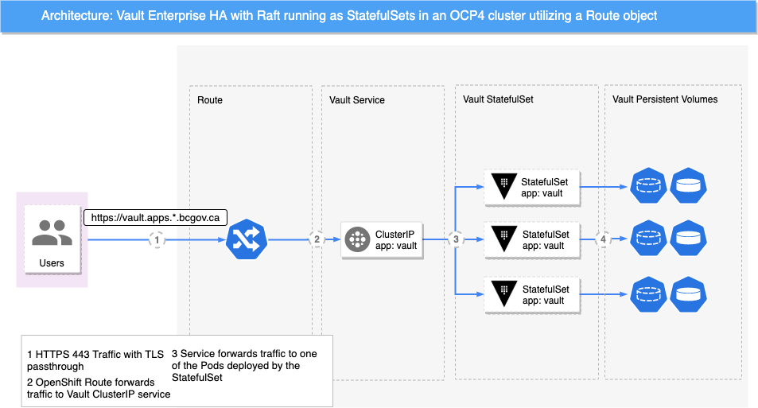

# Introduction

HashiCorp Vault is a secrets management solution.
It enables consumers to secure, store and tightly control access to tokens, passwords, certificates, encryption keys for protecting secrets and other sensitive data using a UI, CLI, or HTTP API.
Vault will be implemented on the OpenShift clusters to integrate with BCGov's applications.

The following diagram highlights the proposed high-level architecture for a highly-available Vault on a single OpenShift cluster:

The Users can consume Vault through its exposed API.
The API is exposed via an OpenShift Route.
This Route object forwards the TLS traffic in passthrough mode to the underlying Vault Service object.
The Service object then communicates with Vault's StatefulSet, which writes its data to a Persistent Volume.

The Vault pods operate in a highly-available cluster mode employing the Raft consensus algorithm for data replication inside the Vault cluster.