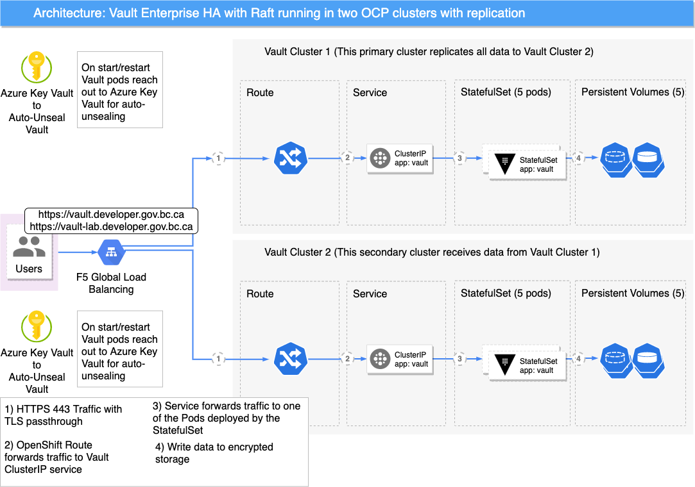
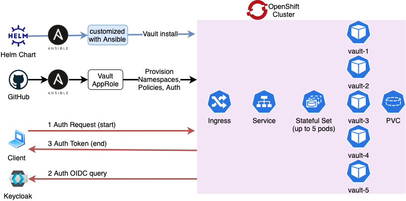

# Introduction

HashiCorp Vault is a secrets management solution.
It enables consumers to secure, store and tightly control access to tokens, passwords, certificates, encryption keys for protecting secrets and other sensitive data using a UI, CLI, or HTTP API.
Vault will be implemented on the OpenShift clusters to integrate with BCGov's applications.

## General Single Cluster Architecture

This section shows Vault on a single Kubernetes cluster.

The following diagram highlights the general high-level architecture for a highly-available Vault on a single OpenShift cluster:

The Users can consume Vault through its exposed API.
The API is exposed via an OpenShift Route.
This Route object forwards the TLS traffic in passthrough mode to the underlying Vault Service object.
The Service object then communicates with Vault's StatefulSet, which writes its data to a Persistent Volume.

The Vault pods operate in a highly-available cluster mode employing the Raft consensus algorithm for data replication inside the Vault cluster.

## Multi-Cluster Architecture

Vault Enterprise enables data replication between different Vault clusters.
A Global Load Balancing mechanism is in front of the two clusters that redirects traffic accordingly (figure below).

## Provisioning Workflow

HashiCorp publishes a Helm Chart for Vault on Kubernetes installations.
This Chart is used in this project to template out the Kubernetes manifests before they are applied
to the cluster (figure below).

