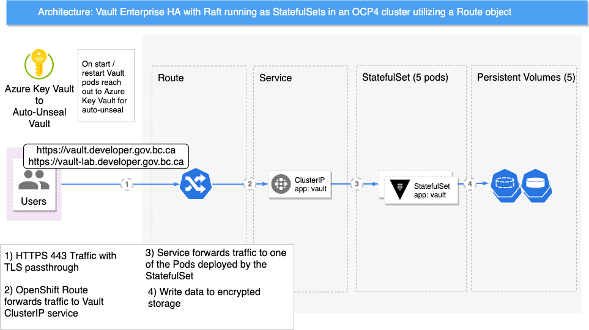
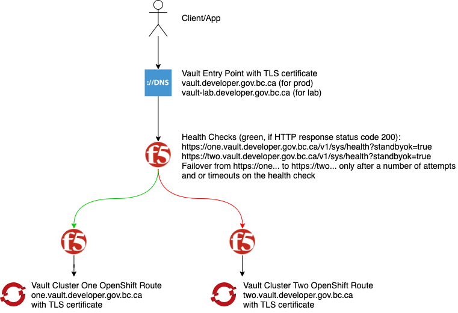

# Introduction

HashiCorp Vault is a secrets management solution.
It enables consumers to secure, store and tightly control access to tokens, passwords, certificates, encryption keys for protecting secrets and other sensitive data using a UI, CLI, or HTTP API.
Vault will be implemented on the OpenShift clusters to integrate with BCGov's applications.

## General Single Cluster Architecture

This section shows Vault on a single Kubernetes cluster.

The following diagram highlights the general high-level architecture for a highly-available Vault on a single OpenShift cluster:

The Users can consume Vault through its exposed API.
The API is exposed via an OpenShift Route.
This Route object forwards the TLS traffic in passthrough mode to the underlying Vault Service object.
The Service object then communicates with Vault's StatefulSet, which writes its data to a Persistent Volume.

The five Vault pods operate in a highly-available cluster mode employing the Raft consensus algorithm for data replication inside the Vault cluster.

## Multi-Cluster Architecture

Vault Enterprise enables data replication between different Vault clusters.
A Global Load Balancing mechanism is in front of the two clusters that redirects traffic accordingly (figure below).

## Provisioning Workflow

HashiCorp publishes a Helm Chart for Vault on Kubernetes installations.
This Chart is used in this project to template out the Kubernetes manifests before they are applied
to the cluster (figure below).

## Traffic Flow

The Vault project team together with DXC has settled on the following DNS and traffic flow (figure below).
Traffic will flow to either the `vault.developer.gov.bc.ca` vanity domain for the production cluster, or to
`vault-lab.developer.gov.bc.ca`.

An F5 load balancer will run health checks against the Vault clusters.
Typically, the left side in the diagram is the active site (`one.vault.developer.gov.bc.ca`). The right side
(`two.vault.developer.gov.bc.ca`) will not receive traffic from any clients until the health check
to the primary/left side fails. \
This is the Disaster Recovery (DR) scenario.
In a DR case, the F5 can either fail over the traffic automatically to the right side, or it can be a manual step.

Importantly, while the failover steps for the Vault application can be automated to an extent, it will require manual intervention.

