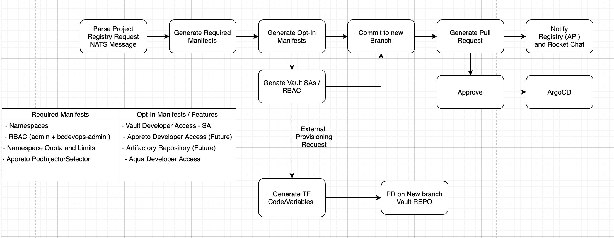

# Provisioning Method for Vault Consumers

This section describes how a new Vault consumer is onboarded through the project provisioning workflow.

## Introduction

Before a new Vault consumer can be onboarded, certain objects must be created in Vault.
The relevant Vault objects are new Secrets Engine mount points, roles, and policies, see [structure-within-vault.md](./structure-within-vault.md).

The premise is to automate this process.

## Flow

There are two "natural" integration points Vault can benefit from.
The first one is the OpenShift project provisioning workflow.
The second integration point is Terraform Cloud as it offers native integration with Vault and
solves the challenge of storing the Terraform `tfstate` file in a secure central location.

The following high-level diagram illustrates the points where Vault consumer provisioning can plug into the
OpenShift project provisioning workflow.
Similar to other opt-in manifests/features, Vault will be optional also.
The flow branches on the **Generate Opt-In Manifests** node and continues downwards for the Vault components.
This branch uses the randomly generated Kubernetes namespace ID, sometimes referred to as the license plate.

Next, the Vault-specific Kubernetes Service Accounts are generated in the new
Kubernetes namespace, including Role-Based Access Control (RBAC).
Then, the required Vault mount points, roles, and policies in the form of Terraform files are generated
in a separate Git repository that is exclusively used by Terraform Cloud.
Once these Terraform files are committed to a new git branch, a git pull request (PR) against the
main branch is opened.
After the PR has been approved Terraform Cloud will reconcile the new resources into Vault and thereby
in its Terraform state (tfstate).

Now that all prerequisites are met for a new team to use Vault, follow the [Vault Consumer Guide](./vault-consumer-guide.md).
