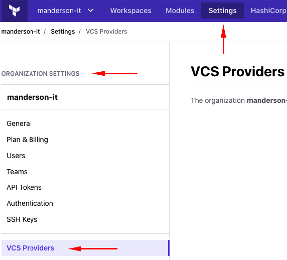

# Set Up TFC Provider for TF Modules

Terraform Cloud (TFC) allows you to publish Terraform modules under your TFC Organization.

To connect workspaces, modules, and policy sets to git repositories containing Terraform configurations, Terraform Cloud needs access to your version control system (VCS) provider.

This guide outlines the steps to connect TFC with GitHub. It then continues to explain how to reference TF modules from TFC.

## Organization Settings (Part 1)

Login to [Terraform Cloud](https://app.terraform.io) and navigate to Organization Settings > VCS Providers (see below).

Click **Add a VCS Provider** to connect TFC to GitHub.

You need to set up an OAuth application on GitHub to complete the next part.
This is what the form looks like.

First, we have to fulfill the requirements on GitHub covered in the next section.

## GitHub - Register a new OAuth Application

Follow the link to register a new OAuth Application on GitHub.

[Register a new OAuth Application](https://github.com/settings/applications/new)

Fill in the form as suggested in the previous section above. Here is an example. Then, register the application.

Now that the application was created successfully, generate a client secret (see below).

The generated Client Secret is **only** visible right after!

Make sure to copy and store the value in a secure location.

5e33d52e1a999307225763300186c8c0d6ca5ce3

## Organization Settings (Part 2)

In your TFC browser tab, enter the information to connect to GitHub and hit **Connect and continue**.

You will see a summary including a button to finally establish the connection from TFC to GitHub. Click the button in the bottom-right **Connect organization GitHub-Org-Name**.

Done! Terraform Cloud is now connected to the GitHub organization so that TFC can pull TF modules from GitHub repositories.

**Note:** TFC expects the GitHub repositories holding Terraform modules to follow its naming convention `terraform-<PROVIDER>-<NAME>`.

## Add Module to Your Organization

Now that Terraform Cloud is connected to your GitHub organization, continue with adding a module.

## References

[https://www.terraform.io/docs/cloud/vcs/github.html](https://www.terraform.io/docs/cloud/vcs/github.html)
