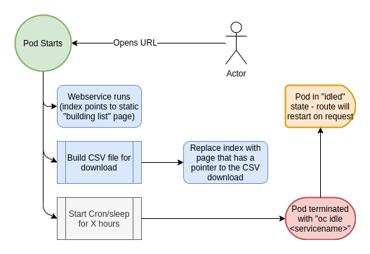

# Repo Mapper

This application will generate a list of OpenShift Project Set metadata and return as csv file available from the frontend.

## Architecture

The repo mapper is a 2 container pod. See the following structure.
- Caddy Container
- Ansible Container




### Ansible Container

The ansible container has all the credentials and logic to perform the audit and create a `csv` file. 

The `csv` is written to a volume in the Caddy Container


### Caddy Container

The caddy container serves a simple website that provides a download link to the csv. 

The website is built from a basic React Boilerplate. You wll find that the React App and Caddy are chain built together. 


### Run on OpenShift
Use the OpenShift manifests to build and deploy the app.
```shell
cd .openshift

# Step 1: update the local.param file to match your setup

# Step 2: Build
oc process --ignore-unknown-parameters=true -f ansible.build.yml --param-file=local.param | oc apply -f -
oc process --ignore-unknown-parameters=true -f web.build.yml --param-file=local.param | oc apply -f -

# Step 3: Deploy when istag complete
oc process --ignore-unknown-parameters=true -f full-app.deployment.yml --param-file=local.param | oc apply -f -
```
