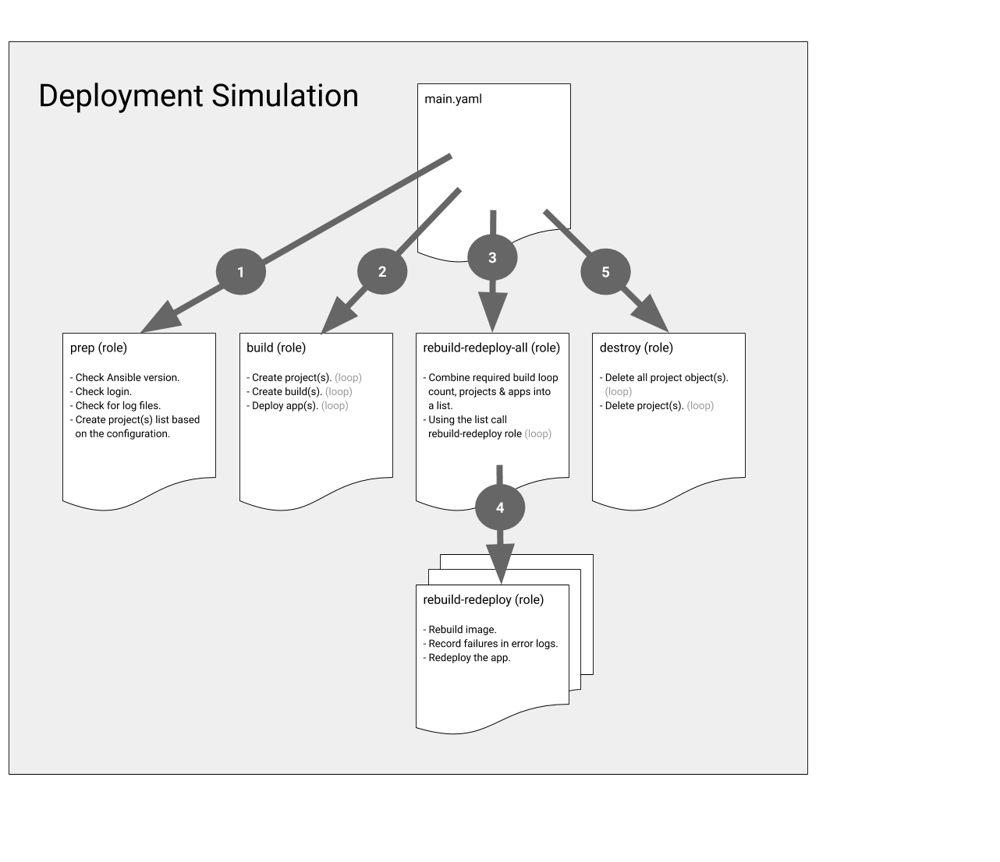

## Developer Simulation on OpenShift

### Architecture

Create automation to simulate application and developer behavior for the pathfinder lab. This would target creating baseline behavior, and providing metrics (totals, failures) during maintenance activities to be able to better predict maintenance impacts. The script aims to capture errors around build and deployment failures. 

### How to run

* `ansible-playbook main.yml` Runs the entire playbook.
* `ansible-playbook main.yml --tags build` Projects will be created. Images will be build. Apps will be created.
* `ansible-playbook main.yml --tags rebuild` Re-builds images. Re-deploys apps. *Projects and apps must already exist.*
* `ansible-playbook main.yml --tags "build, rebuild"` Combines build and rebuild. *Projects and apps must not exist.*
* `ansible-playbook main.yml --tags destroy` Will delete all the project objects. Then it will delete all the projects.

### Configuration

All configuration can be done by editing the `host_vars/localhost.yaml` file.

* `rebuild_loop_count` Sets the number of times the re-build and re-deploy will run.
* `project_count` Sest the number of simulation projects that will be crated.
* `project_name` Sets the base project name. It will be appended with the count.
* `project_display_name` Sets the name of the project that will be displayed.
* `project_desctiption` Sets the project description.
* `min_ansible` Sets the minimum Ansible version that will be checked for.
