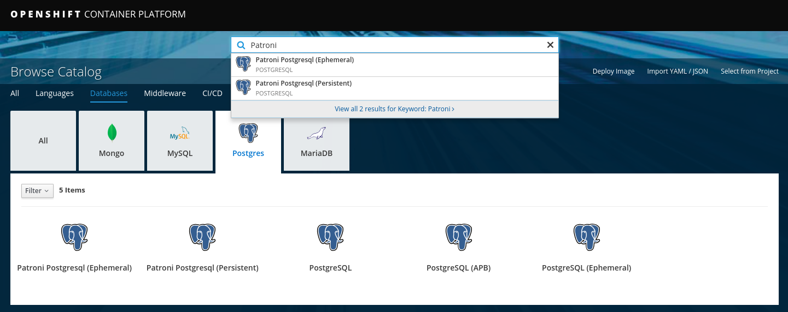
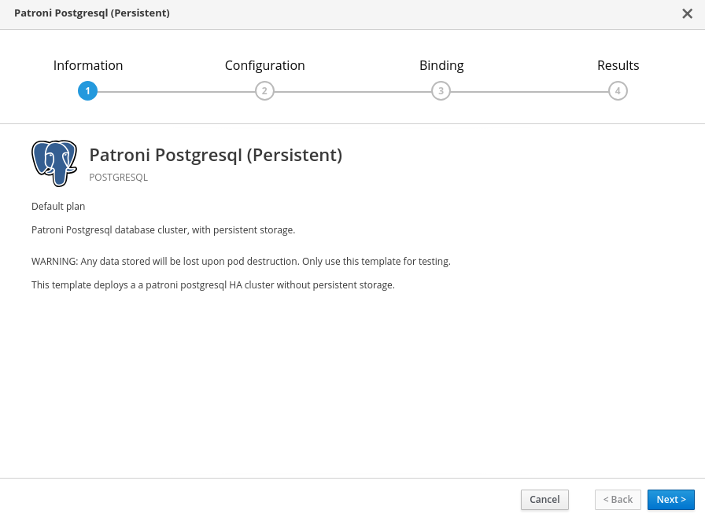
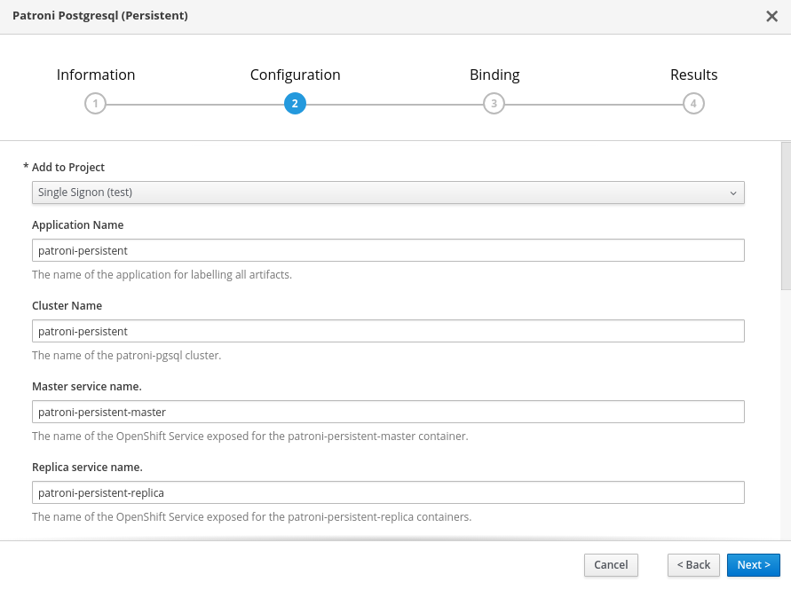
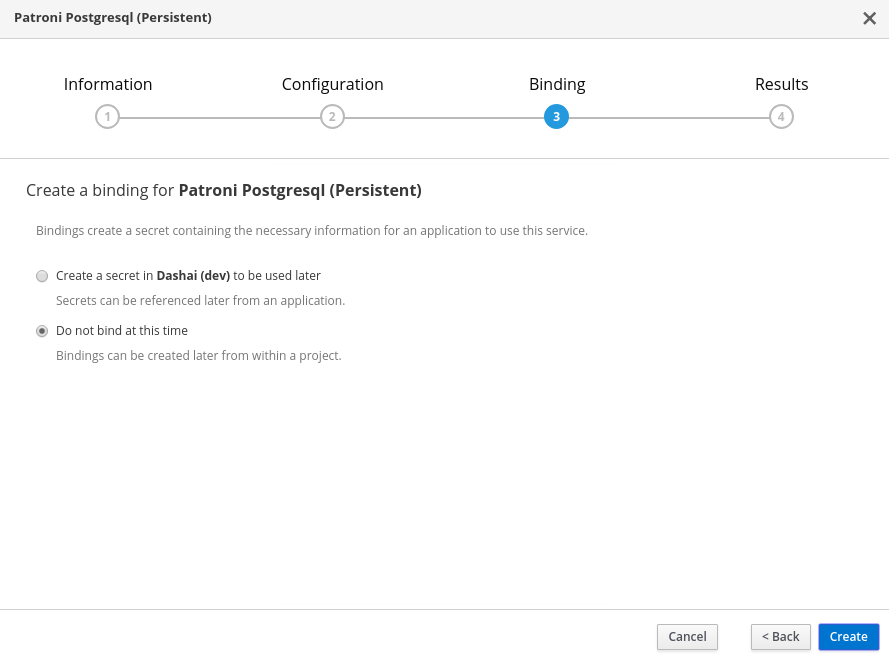

# PostrgreSQL - Patroni
Patroni is a utility inside of a postgres image that helps with management and maintenance of a postgres image. 

## Deploying the Cluster
2 OpenShift templates exist to deploy the Patroni PostgreSQL cluster within an existing namespace. These are presented in the Service Catalog and can also be deployed from the CLI. 

The templates are as follows: 
- patroni-pgsql-ephemeral
- patroni-pgsql-persistent

Each template creates a 3 node StatefulSet. Each StatefulSet consists of a single master and 2 replica nodes. A corresponding service is created to connect to the active master instance at all times. In the event of a master election change, the service will automatically update to the corresponding instance. 
 
### From the CLI
To deploy a cluster from the CLI, use the `oc` command with appropriate paramater overrides.
- Listing the available parameters: 
```
oc process --parameters -n openshift patroni-pgsql-persistent
```
- Review the output
```
NAME                           DESCRIPTION                                                                                GENERATOR           VALUE
APPLICATION_NAME               The name of the application for labelling all artifacts.                                                       patroni-persistent
PATRONI_CLUSTER_NAME           The name of the patroni-pgsql cluster.                                                                         patroni-persistent
PATRONI_MASTER_SERVICE_NAME    The name of the OpenShift Service exposed for the patroni-persistent-master container.                         patroni-persistent-master
PATRONI_REPLICA_SERVICE_NAME   The name of the OpenShift Service exposed for the patroni-persistent-replica containers.                       patroni-persistent-replica
MEMORY_LIMIT                   Maximum amount of memory the container can use.                                                                512Mi
NAMESPACE                      The OpenShift Namespace where the patroni and postgresql ImageStream resides.                                  openshift
PATRONI_SUPERUSER_USERNAME     Username of the superuser account for initialization.                                                          postgres
PATRONI_SUPERUSER_PASSWORD     Password of the superuser account for initialization.                                                          postgres
PATRONI_REPLICATION_USERNAME   Username of the replication account for initialization.                                                        postgres
PATRONI_REPLICATION_PASSWORD   Password of the replication account for initialization.                                                        postgres
SERVICE_ACCOUNT                Service account name used for pods and rolebindings to form a cluster in the project.                          patroni-persistent
PVC_SIZE                       The size of the persistent volume to create.                                                                   5Gi

```

- Deploy the template with the desired parameters

```
oc new-app patroni-pgsql-persistent -p APPLICATION_NAME=test -p PVC_SIZE=1Gi
```


### From the Web Console
From the OpenShift Web Console, each template can be found with the `Search` utility or `Database` category of the Service Catalog. 



- Select the desired template and customize the parameters





## Validating the cluster
The `patronictl` utility, in each image, can be used to validate the cluster status: 

```
postgres@patroni-persistent-2:/home/postgres$ patronictl  list
+--------------------+----------------------+---------------+--------+---------+-----------+
|      Cluster       |        Member        |      Host     |  Role  |  State  | Lag in MB |
+--------------------+----------------------+---------------+--------+---------+-----------+
| patroni-persistent | patroni-persistent-0 |  10.131.22.98 | Leader | running |         0 |
| patroni-persistent | patroni-persistent-1 |  10.131.23.45 |        | running |         0 |
| patroni-persistent | patroni-persistent-2 | 10.131.22.101 |        | running |         0 |
+--------------------+----------------------+---------------+--------+---------+-----------+
postgres@patroni-persistent-2:/home/postgres$
```
